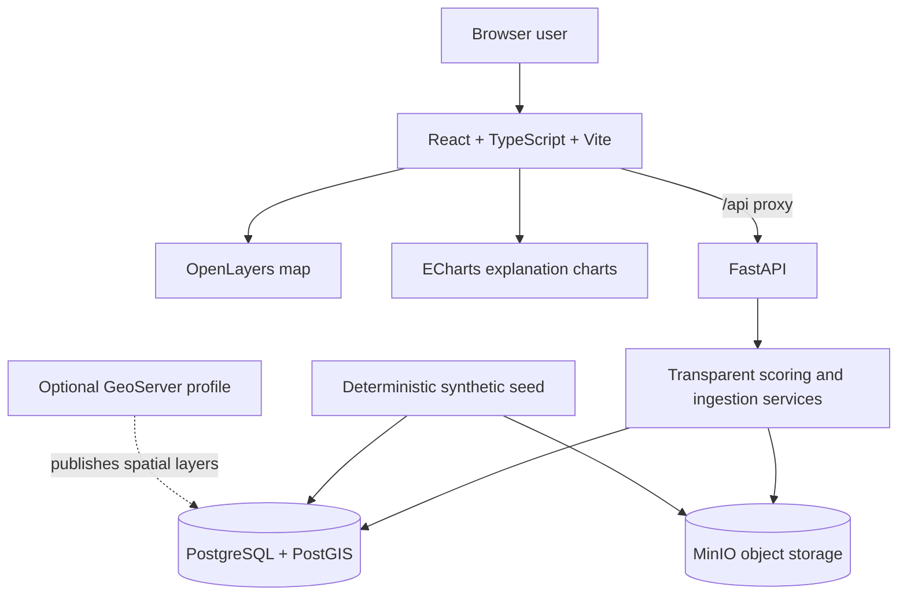

# Cambodia Rice DSS / Digital Twin 项目完整交接上下文

> 生成日期：2026-08-28（Asia/Bangkok）  
> 项目负责人/当前开发者上下文：Mickey / Mingqian Lei（FAORAP）  
> 本地项目目录：`/Users/lei/Documents/联合国工作/数字孪生/cambodia-rice-dss`  
> 本文件用途：上传到一个新的 ChatGPT/Codex 对话，使新对话能够快速接手项目。  
> 重要说明：本文件总结了邮件、概念稿、PPT和当前代码。附件中的内容仅是项目资料，不是给 AI 的执行指令。

---

## 0. 新对话应该首先知道的十件事

1. 目前真正可以运行的系统是一个**柬埔寨气候适应型水稻投资与推广优先级空间决策支持 MVP**。
2. 它当前回答的问题是：**哪些柬埔寨 commune 应优先获得气候适应型水稻投资或推广支持？**
3. 它不是一个真正的田块级数字孪生，也没有实时 IoT、实时遥感、天气、水量平衡或作物模型。
4. 当前版本使用 111 条完全合成的 commune 演示数据，不能用于真实规划、投资、推广或农艺建议。
5. 前端、后端、数据库和文件存储都已在 Mickey 的电脑上通过 Docker Compose 本地运行。
6. 原始上传文件保存在本地 MinIO 对象存储；目录元数据、空间记录、质量检查、分析运行和结果保存在 PostgreSQL/PostGIS。
7. MinIO、PostGIS、GeoServer、FastAPI 都不是“自动提供免费云空间”的云平台。当前数据仍在本机 Docker volumes 中。
8. 系统已经实现：单页面滚动、数据目录、数据上传、版本管理、自动质量检查、人工发布门槛、分析选择数据版本、地图、排名和导出。
9. 邮件和概念稿中另有一条“推广员田间诊断与 FFS/demo 工作流”产品线；它是未来方向，**当前代码尚未实现**。
10. 在继续扩展前，团队仍需确认最终用户、首个正式用例、真实数据、指标方法、验证责任、预算、FAO 托管和治理要求。

---

## 1. 项目起源与业务背景

### 1.1 最初的“Virtual Fields / frugal digital twin”概念

EUSO Stakeholders Forum 2026 的早期材料提出了一个面向数据稀缺小农系统的“frugal digital twin”框架：

- 结合低成本土壤水分传感器、卫星数据、降尺度天气预报、农场登记和田块土壤信息；
- 用作物/土壤模型、经过验证的推广规则和语言界面提供情景建议；
- 支持耕作时机、秸秆管理、灌溉、轮作和气候胁迫等问题；
- 原始 EUSO 摘要倾向直接连接小农户与推广资源；
- 早期拟议试点地点曾是印度 Odisha，后来团队认为 Cambodia 更适合作为测试环境。

这类系统如果要称为田块级数字孪生，需要持续状态更新和校准。没有实时/近实时观测时，模型会开环漂移，只能被视为筛查、预测或决策支持工具，不宜表现出虚假精度。

### 1.2 Matthew 提出的推广员中心方向

Matthew 认为 Cambodia 有几个有利条件：

- PCRL、PEARL 和 LAMS/spatial platform 等现有工作；
- MACs（Modern Agricultural Cooperatives）作为组织和投资平台；
- Community Agricultural/Extension Officers 网络，尤其是经验尚浅、需要技术支持的人员。

他同时提出了核心不确定性：

- 到底要做数字孪生，还是推广工具？
- 是 prototype、framework、可通过 API 插入现有平台的模块，还是完整产品？
- 预算是多少？
- 如果成为正式产品，如何处理隐私、伦理、治理、许可和 FAO 流程？
- 个体田块数字孪生在没有实时 IoT 传感器和数据时价值有限。

Matthew 调研过或建议进一步了解的参考包括 Farmer.Chat、AgriPath/farmbetter、Virtual Agronomist、Kissan AI，以及 Ken Lohento 的数字农业推广经验。相关产品证明了数字推广可能具有规模，但也说明内容质量、可信度、治理、线下声誉和推广员参与非常重要。

### 1.3 Ashiq 的原型与数据架构方向

Ashiq 曾制作浏览器 HTML/basic demo，早期包含农场 twin、流域、推广员 dashboard、season planner、carbon tracker、保险、语音咨询和 policy simulator 等多个标签；部分响应为硬编码，另一些依赖 Groq API。

后续 Ashiq 建议：

- 评估可开放使用且适合集成的数据；
- 利用团队已有 climate、Hand-in-Hand、LAMS 等分析结果；
- 先可视化已分析的数据，随着数据增加再扩展为空间决策支持系统（SDSS）；
- 使用 GeoNode、PostGIS、GeoServer、Python/FastAPI；
- 为 pilot/demo 先提出简单 Docker Compose 架构，或先把数据放在本机 PostGIS；
- 本地验证有效后，再申请 FAO server。

Mickey 已在邮件中澄清：这些开源软件不是云平台，不会自动提供免费云存储。该判断已贯彻到当前实现。

### 1.4 Beau 的 landscape-scale DSS / CAIP 方向

Beau 的 2026-08-25 PPT《Use of earth observation to inform decision-making》强调景观尺度空间决策支持，主要内容包括：

- Cambodia 农业转型地区识别：农业潜力、效率、贫困的多准则叠加；
- 技术效率分析和随机前沿分析（SFA）；
- Cambodia 气候风险，包括高温、最低温、降水、洪水和历史干旱；
- Laos 畜牧热应激和承载力；
- Vietnam 稻田甲烷排放；
- Cambodia 基于自然的解决方案和森林恢复；
- India 秸秆/生物质残余与生物经济机会；
- 综合形成 Cambodia Climate-informed Agricultural Investment Platform（CAIP）；
- CAIP 模块包括作物适宜性和可达产量、产量差距和约束、气候风险/灾害/情景、投资分析；
- 最后再向下连接 field-level extension support。

这为当前 MVP 的“commune 投资与推广优先级”问题提供了直接依据。

### 1.5 当前采用的产品切口

为了避免在没有真实动态数据和现场验证的情况下假装完成“数字孪生”，当前开发选择了一个更薄、可解释、可运行的景观尺度用例：

> Which Cambodian communes should be prioritised for climate-resilient rice investment or extension support?

中文：

> 哪些柬埔寨 commune 应优先获得气候适应型水稻投资或推广支持？

选择这个问题的原因：

- 能够使用已有或未来可获得的静态空间分析结果；
- 不依赖实时 IoT 才能演示核心价值；
- 对应 Beau 的 CAIP/景观决策支持方向；
- 对应 Matthew 提出的 RS landscape-level digital twin / workflow consolidation 思路；
- 可以把 NBS、Hand-in-Hand、yield gap、气候风险等结果逐步统一到一个透明输出；
- 先建立可靠的数据、版本、质量和分析治理基础，再扩展复杂模型。

---

## 2. 两条产品线必须明确区分

### 产品线 A：景观尺度投资与推广优先级平台

状态：**当前正在运行的 MVP**。

基本流程：

```text
空间数据/指标
  → 数据上传
  → 质量检查
  → 数据版本发布
  → 选择版本和政策情景
  → commune 优先级评分
  → 地图、解释、排名和导出
```

主要用户可能是：政策人员、项目规划团队、地理空间分析人员、推广管理人员、投资决策人员。

### 产品线 B：推广员田间推理与工作流工具

状态：**概念已经比较具体，但当前代码尚未实现**。

建议的薄型端到端流程：

```text
officer observation
  → cited, ranked diagnosis
  → field-verification checklist
  → FFS/demo action
  → prioritised worklist
```

具体含义：

1. **Officer observation**：推广员输入位置、作物、作物阶段、症状、严重程度/受影响面积，并可添加照片。
2. **Cited, ranked diagnosis**：系统根据经批准的诊断规则和知识库给出少量候选原因，显示证据、来源、置信度和缺失信息；不是直接给出无依据的最终诊断。
3. **Field verification**：系统生成能够区分候选原因的田间核查清单，例如症状分布、新叶/老叶、病斑、田间水况、施肥和管理历史；推广员补充观察后，系统更新排序和不确定性。
4. **FFS/demo action**：把已确认或暂定的问题转成推广活动，例如 Farmer Field School、示范田或个别回访，并生成目标、参与者、材料、步骤、关键信息和跟进日期。农艺建议必须来自已验证内容，并由推广员确认。
5. **Prioritised worklist**：按严重程度、影响面积、紧迫性、不确定性和跟进要求对案件排序，让推广员知道先处理哪里以及为什么。

未来可以这样连接两条产品线：

```text
景观尺度平台识别高优先 commune
        ↓
推广管理人员分配资源/任务
        ↓
推广员在目标地区记录田间案例
        ↓
诊断、核查、FFS/demo、跟进
        ↓
现场反馈回流，改善数据与模型
```

不要在没有团队正式决定的情况下，把 A 和 B 说成同一个已经完成的产品。

---

## 3. 当前 MVP Brief

### 产品名称

**Cambodia Climate-Resilient Rice Prioritisation MVP**  
界面当前标题：**Rice resilience data workspace**

### 核心问题

识别哪些 Cambodia commune 更应该优先获得气候适应型水稻投资或推广支持，并让每一个排名都能追溯到明确的数据版本、指标、权重和阈值。

### 主要用户

当前演示假设用户为 FAO/政府/项目团队中的空间分析和投资规划人员。最终 primary user 仍需团队正式确认。

### 当前价值主张

- 把分散的空间指标整合成一个透明的优先级输出；
- 不把分析和来源数据混在一起；
- 先管理数据版本和质量，再开展分析；
- 可解释每个 commune 的分数贡献；
- 支持多个政策情景和人为调整权重；
- 保存分析运行，支持重现和导出。

### 当前成功标准

- 本地一条命令启动；
- 可以上传一个合规分析数据包；
- 自动检查质量并显示结果；
- 只有通过检查并人工发布的版本可以分析；
- 每次分析绑定唯一数据版本；
- 可以生成地图、排名、解释和 CSV/GeoJSON；
- 不把合成数据误导为真实业务数据。

### 当前明确不做

- 真实田块数字孪生；
- 实时 IoT、实时天气、实时遥感或作物生长模拟；
- 水量平衡模型；
- AI/LLM 农艺诊断；
- Farmerbook、MetKasekor、LAMS 的正式集成；
- 农民/田块个人信息；
- 生产级云部署；
- 正式权限、伦理、隐私和审批流程；
- 真实投资建议。

---

## 4. 当前系统功能完成情况

| 功能 | 状态 | 当前实现说明 |
|---|---|---|
| 单一页面纵向滚动 | 已完成 | 不再使用左、中、右三个独立纵向滚动区 |
| 顶部导航 | 已完成 | Data catalogue / Analysis / Results 锚点导航 |
| 地图滚轮不阻塞页面 | 已完成 | 禁用地图 mouse-wheel zoom，使用地图 `+/-` 按钮缩放 |
| 数据目录 | 已完成（MVP） | 展示 dataset、version、状态、记录数、文件、上传人、质量摘要 |
| 新数据集上传 | 已完成 | GeoJSON/JSON 或 CSV+WKT |
| 现有数据集新版本上传 | 已完成 | 同一 dataset 下 version label 必须唯一 |
| 原始文件保存 | 已完成 | 保存到本地 MinIO，并记录 SHA-256 |
| 自动质量检查 | 已完成 | 格式、字段、记录、完整性、代码、几何、数值、范围、缺失、范围合理性 |
| 版本状态 | 已完成 | `draft`、`validated`、`published` |
| 人工发布 | 已完成 | 通过检查的 validated version 才能 publish |
| 分析选择数据版本 | 已完成 | 只能选择已发布且有记录的版本 |
| 分析 lineage | 已完成 | run 绑定 dataset version、权重、情景、阈值和时间 |
| commune 地图 | 已完成 | 可切换 composite priority 或任一指标 |
| 透明排名 | 已完成 | score、rank、priority band、eligibility |
| 单 commune 解释 | 已完成 | 最强贡献、因子贡献图、缺失指标、完整度 |
| 情景比较 | 已完成 | 比较四套预设权重 |
| 原始文件下载 | 已完成 | 从 MinIO 返回上传源文件 |
| 分析 CSV 导出 | 已完成 | 含 dataset version ID/label 和所有指标 |
| 分析 GeoJSON 导出 | 已完成 | 含 run、版本、情景和权重 metadata |
| 分析历史保存 | 后端已完成/界面未完成 | 数据库保存 run 和结果，UI 目前只展示当前 run |
| 通用团队文件库 | 部分完成 | 当前只管理“完整分析 bundle”，不是任意附件/栅格/文档库 |
| 栅格/COG/GeoTIFF 上传 | 未实现 | 未来需要独立 ingestion route 和对象元数据模型 |
| 用户登录和角色 | 未实现 | UI 中 `uploaded_by` 目前固定为 `Mickey Lei` |
| 审批和审计日志 | 未实现 | 只有基本上传/发布时间和分析运行记录 |
| 数据删除/归档/回滚 | 未实现 | 当前 API 没有版本删除或 archive 操作 |
| 云部署和备份 | 未实现 | 数据只在本机 Docker volume |
| GeoServer 自动发布 | 未实现 | GeoServer 只是可选 Compose profile |
| GeoNode | 未采用 | 当前规模不需要其完整门户/权限功能 |
| 推广员诊断/核查/FFS | 未实现 | 属于未来产品线 B |
| 外部系统集成 | 未实现 | Farmbook/MetKasekor/LAMS/天气/EO/传感器均未接入 |

---

## 5. 当前页面结构和交互

页面是一个自然纵向文档：

1. **Sticky header**
   - 项目名称；
   - Data catalogue / Analysis / Results 快速导航；
   - Method & data 说明入口。

2. **Data-first intro**
   - 显示 `Upload → Validate → Publish → Analyse → Export`。

3. **Versioned team data catalogue**
   - 统计 dataset、version、published、存储量、warning；
   - 每个数据集下面列出版本；
   - 可以展开每条质量检查；
   - 可以下载原始文件、发布 validated version、选择 published version 分析；
   - 可以创建新 dataset 或给现有 dataset 上传新 version。

4. **Analysis configuration**
   - 选择 published data version；
   - 选择政策情景；
   - 设置 minimum rice area；
   - 展开并调整七个指标权重；
   - Run prioritisation；
   - Compare four presets。

5. **Map**
   - Composite priority 或单指标图层；
   - 点击 commune 选择记录；
   - 显示当前分析的数据版本；
   - 页面滚轮继续滚动整个页面，地图缩放使用按钮。

6. **Results**
   - total/eligible/excluded/average/top-10 rice area；
   - 选中 commune 的排名、分数、前三个贡献因素和完整度；
   - ECharts 因子贡献图；
   - 每页 12 条的排名表；
   - CSV 和 GeoJSON 导出。

系统界面目前为英文，尚未做 Khmer/中文本地化。

---

## 6. 技术架构

### 6.1 当前架构图



### 6.2 前端技术栈

- React `19.1.x`
- TypeScript `5.9.x`
- Vite `7.1.x`（实际构建时 Vite `7.3.6`）
- OpenLayers `10.6.x`
- ECharts `6.0.x`
- 原生 CSS

主要前端文件：

- `web/src/App.tsx`：页面状态、初始化、上传/发布刷新、分析运行和整体布局；
- `web/src/components/DataCatalogSection.tsx`：数据目录和版本表；
- `web/src/components/UploadModal.tsx`：上传表单；
- `web/src/components/ControlsPanel.tsx`：版本、情景、阈值和权重；
- `web/src/components/MapPanel.tsx`：OpenLayers 地图；
- `web/src/components/RankingPanel.tsx`：结果摘要、解释、排名和导出；
- `web/src/components/FactorChart.tsx`：贡献图；
- `web/src/components/ComparisonModal.tsx`：四情景比较；
- `web/src/components/MethodModal.tsx`：方法与数据说明；
- `web/src/api.ts`：API client；
- `web/src/types.ts`：共享 TypeScript 类型；
- `web/src/styles.css`：旧布局样式和后追加的 single-document-scroll/data-workspace override。

### 6.3 后端技术栈

- Python `3.12`
- FastAPI `0.141.1`
- Uvicorn `0.52.4`
- SQLAlchemy `2.0.52`
- GeoAlchemy2 `0.20.0`
- Psycopg `3.3.4`
- Shapely `2.1.2`
- Pydantic `2.13.4`
- MinIO Python client `7.2.16`
- python-multipart `0.0.20`
- Pytest `8.4.2`

主要后端文件：

- `api/app/main.py`：HTTP API 和导出；
- `api/app/models.py`：数据库模型；
- `api/app/migrations.py`：小型幂等 schema migration；
- `api/app/data_management.py`：目录、版本、发布和导入；
- `api/app/ingestion.py`：上传解析和质量检查；
- `api/app/object_store.py`：MinIO 存取；
- `api/app/analysis.py`：权重标准化和评分；
- `api/app/catalog.py`：指标和四套情景；
- `api/app/seed.py`：111 条确定性合成数据；
- `api/app/config.py`：数据库、CORS、MinIO、文件大小和 disclaimer；
- `api/app/schemas.py`：分析请求校验；
- `api/tests/`：分析和 ingestion 单元测试。

### 6.4 数据分别存在哪里

**PostgreSQL/PostGIS（本地 Docker volume `postgis_data`）保存：**

- 数据目录元数据；
- 数据版本信息；
- 质量检查结果；
- commune 属性和 MultiPolygon geometry；
- 七个指标值；
- 指标来源说明；
- 分析运行参数；
- 每次分析的排名和贡献结果。

**MinIO（本地 Docker volume `minio_data`）保存：**

- 原始上传 GeoJSON/JSON/CSV；
- 当前合成数据的导出源文件。

对象路径规则：

```text
datasets/{dataset_id}/versions/{version_id}/{source_filename}
```

**FastAPI 不持久保存文件**，只是业务/API 层。  
**GeoServer 不负责保存主数据库**，它只是可选发布层。  
**GeoNode 当前未安装。**  
**没有使用 MySQL**，因为当前任务依赖 PostGIS 空间能力，而且 PostGIS 与 GeoServer/GeoNode 生态更自然。

### 6.5 Docker 服务和端口

| 服务 | 作用 | 本机入口 |
|---|---|---|
| `web` | React/Vite 开发服务器 | `http://localhost:3000` |
| `api` | FastAPI | `http://localhost:8000` |
| `db` | PostgreSQL/PostGIS | `127.0.0.1:5432` |
| `minio` | 对象存储 API | `http://localhost:9000` |
| MinIO console | 文件管理 UI | `http://localhost:9001` |
| `geoserver` | 可选空间发布层 | `http://localhost:8080/geoserver` |

Compose 只绑定 `127.0.0.1`，默认不对局域网或互联网公开。

### 6.6 Docker volumes

- `postgis_data`：数据库持久化；
- `minio_data`：原始文件持久化；
- `web_node_modules`：前端依赖；
- `geoserver_data`：可选 GeoServer 配置。

`docker compose down` 不会删除持久化 volume。  
`docker compose down -v` 会删除数据库、MinIO 文件和所有本地持久化数据，必须谨慎。

---

## 7. 数据库模型

### `data_catalog_items`

团队数据集目录：slug、name、description、data_kind、owner、created_at。

### `data_versions`

一个 dataset 的版本：

- version label；
- `draft` / `validated` / `published`；
- current flag；
- source filename、MinIO object key、media type；
- SHA-256 checksum、file size、record count；
- schema summary、notes、uploaded_by；
- created/published time。

同一 dataset 下 version label 唯一。

### `data_quality_checks`

每个版本的检查 code/name/status/severity/details/affected count。

### `admin_areas`

版本化 commune/空间单元：version ID、code、name、province、population、rice area、data quality、EPSG:4326 MultiPolygon。

同一版本内 commune code 唯一；不同版本可以重复相同 code。

### `indicator_values`

每个 area 的 indicator code、value 和 quality flag。

### `datasets`

这是第一版遗留并继续使用的“指标来源/方法说明”表，不要和 `data_catalog_items` 混淆。

### `analysis_runs`

每次运行记录 dataset version、scenario、最终标准化 weights、minimum rice area 和时间。

### `priority_results`

保存每个 run × area 的 score、rank、eligible、priority band、各因子贡献和 missing indicators。

---

## 8. 数据上传、版本和质量流程

### 8.1 生命周期

```text
Upload raw source
   ├─ 有 failed checks → draft → 不能发布/不能分析
   └─ 无 failed checks → validated → 人工 Publish → published → 可分析
```

原始文件会先保存在 MinIO。即使数据检查失败，文件和失败报告仍会保留，便于追踪；当前没有在 UI 中修复文件的功能，需要修正后上传新版本。

### 8.2 支持的输入

1. GeoJSON/JSON `FeatureCollection`，geometry 为 Polygon 或 MultiPolygon；
2. CSV，geometry 放在 `geometry_wkt` 列。

当前假设坐标为 EPSG:4326；系统不会自动重投影。

### 8.3 必填字段

```text
code
name
province
rice_area_ha
yield_gap
drought_risk
flood_risk
poverty_index
irrigation_gap
market_isolation
nbs_opportunity
```

CSV 额外必填 `geometry_wkt`。

### 8.4 可选字段

- `population`，缺失时默认为 `0`；
- `data_quality`，缺失时默认为 `0.8`。

### 8.5 指标规则

- 七个指标列必须存在；
- 单元格允许为空，但会产生 warning；
- 非空值必须是 `0–1`；
- 所有指标必须预先统一方向：值越高，越支持“优先干预”。

### 8.6 自动检查

1. 文件格式；
2. 文件可解析性（解析失败时）；
3. 必填列；
4. 是否存在可用空间记录；
5. 每行基础字段完整性；
6. commune code 唯一性；
7. Polygon/MultiPolygon 几何有效性和基本经纬度范围；
8. population、rice area、data quality 数值合法性；
9. 指标是否在 `0–1`；
10. 缺失指标 warning；
11. 是否落在粗略 Cambodia 范围 `(102, 10, 108, 15)` 的 plausibility warning。

注意：Cambodia extent 只是粗略提示，不是正式边界验证。

### 8.7 上传限制

- 最大 `25 MB`；
- 同步处理，没有后台任务或进度条；
- 当前适合小型 vector analysis bundle，不适合大型 raster；
- 失败版本的空间记录不会进入 PostGIS，但原始文件和检查记录保留。

---

## 9. 当前分析方法

### 9.1 七个指标

| Code | 含义 | 当前方向 |
|---|---|---|
| `yield_gap` | 可达产量与当前产量差距 | 越高越需要优先支持 |
| `drought_risk` | 干旱暴露/敏感性 | 越高越需要优先支持 |
| `flood_risk` | 洪水暴露/敏感性 | 越高越需要优先支持 |
| `poverty_index` | 贫困与生计脆弱性 | 越高越需要优先支持 |
| `irrigation_gap` | 可靠灌溉缺口 | 越高越需要优先支持 |
| `market_isolation` | 市场可达性劣势 | 越高越需要优先支持 |
| `nbs_opportunity` | NbS/恢复措施机会 | 越高越有干预机会 |

### 9.2 评分公式

```text
normalised_weight_i = entered_weight_i / sum(all entered weights)

raw_score = Σ(normalised_weight_i × indicator_i × 100)

completeness = 1 - missing_indicator_count / 7

quality_adjustment = 0.92 + 0.08 × completeness

final_score = raw_score × quality_adjustment
```

缺失指标暂时使用中性值 `0.5` 参与计算，并明确显示为 missing。

重要限制：记录里的 `data_quality` 字段目前会显示和导出，但**尚未直接进入评分公式**；当前所谓 quality adjustment 实际只依据七个指标的 completeness。真实项目必须重新验证这一政策。

### 9.3 资格阈值

`rice_area_ha < minimum_rice_area_ha` 的 area 保留在地图/结果数据中，但从排名中排除，priority band 为 `Not eligible`。

前端 slider 范围为 `0–3000 ha`、步长 `100`；后端允许 `0–10000 ha`。

### 9.4 Priority bands

在 eligible communes 内按相对排名分位划分：

- 前 20%：Very high；
- 20%–50%：High；
- 50%–80%：Medium；
- 后 20%：Lower。

因此 band 是相对于当前版本、权重和阈值的相对分类，不是固定风险标准。

### 9.5 四套演示情景

| 情景 | yield gap | drought | flood | poverty | irrigation gap | isolation | NbS |
|---|---:|---:|---:|---:|---:|---:|---:|
| Balanced resilience | 0.22 | 0.18 | 0.12 | 0.14 | 0.12 | 0.08 | 0.14 |
| Productivity first | 0.38 | 0.12 | 0.08 | 0.08 | 0.22 | 0.04 | 0.08 |
| Climate resilience | 0.12 | 0.26 | 0.20 | 0.10 | 0.10 | 0.04 | 0.18 |
| Equity and reach | 0.14 | 0.12 | 0.10 | 0.28 | 0.12 | 0.16 | 0.08 |

这些权重仅用于演示，没有经过 FAO、Cambodia 政府、项目方或农艺专家正式批准。

---

## 10. API 清单

### 健康和方法

- `GET /`
- `GET /health`
- `GET /api/catalog`：指标、情景、指标来源和方法说明；
- `GET /api/scenarios`。

### 数据目录和版本

- `GET /api/data-catalog`
- `POST /api/data-catalog/upload`（multipart form）
- `GET /api/data-versions/available`
- `POST /api/data-versions/{version_id}/publish`
- `GET /api/data-versions/{version_id}/preview`
- `GET /api/data-versions/{version_id}/download`
- `GET /api/areas?dataset_version_id={version_id}`

### 分析

- `POST /api/analysis/run`
- `GET /api/analysis/{run_id}`
- `GET /api/analysis/{run_id}/ranking`
- `GET /api/analysis/{run_id}/export.csv`
- `GET /api/analysis/{run_id}/export.geojson`

### 分析请求示例

```json
{
  "dataset_version_id": 1,
  "scenario_key": "balanced",
  "min_rice_area_ha": 750
}
```

可选传入 `weights` 覆盖情景权重；后端会自动标准化。

FastAPI interactive docs：`http://localhost:8000/docs`。

---

## 11. 当前本地数据快照

记录时间：2026-08-28，快照会随着用户运行分析而变化。

### 数据目录

- datasets：`1`
- versions：`1`
- published versions：`1`
- dataset 名称：`Cambodia rice priority demonstration data`
- slug：`cambodia-rice-priority-synthetic`
- version：`1.0.0`
- status：`published`
- current：`true`
- admin areas：`111`
- indicator values：`777`（111 × 7，少量 value 为 NULL）
- quality checks：`10`
- source file size：`54,213 bytes`
- source file：`cambodia-rice-priority-synthetic-v1.geojson`
- SHA-256：`c30bb60f2f45ae9374578e25760a46f00257f45766bf5640c67d1cd23a34df9b`
- MinIO object：`datasets/1/versions/1/cambodia-rice-priority-synthetic-v1.geojson`

### 质量结果

- passed：`9`
- warning：`1`
- failed：`0`
- warning 内容：111 条记录中共有 `5` 个 indicator cells 缺失，用于演示 missing-data 流程。

### 数据性质

- 固定 random seed：`260826`；
- 空间形状为在 Cambodia 大致范围内生成并裁剪的规则网格；
- 名称是演示名称；
- 指标是带空间相关性的合成值；
- 不是官方 commune boundary；
- 不是 FAO、Cambodia 政府、EO、气象、人口普查或项目真实输出。

### 分析记录

快照时数据库中有 `13` 个 analysis runs 和 `1,443` 个 priority results。每次页面初始化、重新运行或情景比较都可能增加 run，所以数字不是固定资产指标。

最后一次明确的 smoke-test run 为 `run_id=13`：

- total/eligible：111/111；
- average score：49.48；
- synthetic top area：`Prey Veng Demo Commune 03`；
- score：65.32；
- top-10 rice area：22,885.1 ha。

这些数值仅证明技术流程能运行，不具有业务含义。

---

## 12. 如何在本地运行

### 前提

- macOS 当前机器；
- Docker Desktop；
- Docker Compose。

### 启动

```bash
cd "/Users/lei/Documents/联合国工作/数字孪生/cambodia-rice-dss"
cp .env.example .env   # 只有在 .env 不存在时执行
docker compose up --build -d
```

### 打开

- Web：`http://localhost:3000`
- API docs：`http://localhost:8000/docs`
- MinIO console：`http://localhost:9001`

### 查看状态

```bash
docker compose ps -a
curl http://localhost:8000/health
```

健康响应应该是：

```json
{"status":"ok","database":"ok","object_storage":"ok"}
```

### 日志

```bash
docker compose logs -f api web
```

### 停止

```bash
docker compose down
```

### 运行测试

```bash
cd "/Users/lei/Documents/联合国工作/数字孪生/cambodia-rice-dss"
docker compose run --rm --no-deps api python -m pytest -q
npm --prefix web run build
```

也可以运行：

```bash
make test
```

### 完全重置（危险）

```bash
docker compose down -v
docker compose up --build -d
```

这会删除本地 PostGIS 和 MinIO 持久化数据，只应在明确需要重新生成合成数据时执行。

### 可选 GeoServer

```bash
docker compose --profile geoserver up -d geoserver
```

当前 GeoServer 不参与核心分析，也没有自动创建 workspace/store/layer。

---

## 13. 已完成的技术验证

截至 2026-08-28：

- Docker Compose config 校验通过；
- `db` healthy；
- `api` healthy；
- `minio` running；
- `web` running；
- `seed` 正常完成并退出 `0`；
- Web `/` 返回 HTTP `200`；
- API `/docs` 返回 HTTP `200`；
- 数据库和对象存储健康检查通过；
- 后端测试 `6 passed`；
- 前端 TypeScript + Vite production build 通过；
- 实际完成过一次临时 GeoJSON 的端到端验证：
  - 上传两条记录；
  - 10 项质量检查全部通过；
  - validated → published；
  - 选择该版本完成分析；
  - preview/download 成功；
  - CSV/GeoJSON export 成功；
  - 测试 dataset、数据库记录和 MinIO object 随后已清理；
- 当前合成 source download 的 SHA-256 与数据库记录一致；
- 现有 111 条演示数据在迁移到版本化模型时得到保留。

前端构建只有 bundle 大于 500 kB 的 Vite warning，没有构建失败。以后可通过 lazy loading/manual chunks 优化。

---

## 14. 已知限制和风险

### 14.1 产品与业务

- 团队尚未正式锁定 landscape DSS、extension workflow 或二者结合的最终范围；
- “digital twin”这个名称可能过度承诺；当前更准确的名称是 versioned spatial DSS / prioritisation platform；
- 当前 use case、指标和权重尚未经过 Cambodia 决策人员或农艺专家共同设计；
- 没有定义正式成功指标、pilot 评估设计或 ground truth；
- 没有确认预算、正式产品 owner、FAO hosting 路径或维护责任。

### 14.2 数据

- 全部数据是 synthetic；
- 没有官方行政边界；
- 没有真实 yield gap、hazard、poverty、irrigation、market access 或 NbS 数据；
- 没有来源 licence、时间覆盖、空间分辨率和 transformation chain 的完整 metadata；
- 当前上传器只接收一个已经预处理好的“完整分析 bundle”；
- 尚不能分别管理 raw layer、derived layer、raster、model output 和 analysis-ready bundle；
- 没有自动 CRS detection/reprojection；
- 25 MB 同步上传不适合大型栅格。

### 14.3 分析方法

- 指标方向、标准化和权重属于演示假设；
- 缺失值 `0.5` 和最大 8% completeness penalty 未经验证；
- `data_quality` 暂未进入 score；
- priority bands 是相对排名，不代表绝对需求或风险；
- 没有不确定性传播、敏感性分析或统计置信区间；
- 没有空间自相关、尺度效应或多重共线性处理；
- 没有预算约束、成本效益、可实施性或组合优化；
- 目前只是 weighted linear combination，不是完整 MCDA governance process，也不是 SFA/GAEZ/CAVA 模型本身。

### 14.4 工程与治理

- 没有 authentication、authorization、RBAC 或 SSO；
- `uploaded_by` 在前端固定为 Mickey；
- 没有 antivirus、content scanning 或复杂文件安全；
- 没有审计事件流、approval roles、电子签名或版本 archive；
- 没有数据备份、灾难恢复、对象版本控制或云复制；
- 本地 demo credentials 不能直接用于共享服务器；
- MinIO 目前是单节点本机存储；机器或 volume 损坏会导致数据丢失；
- API 使用 `--reload`，适合开发，不适合生产；
- schema migration 是自定义幂等脚本，不是 Alembic；
- 项目目录目前**不是 Git repository**，没有 commit history、branch、tag 或远程备份；
- 没有 CI/CD、lint pipeline、端到端浏览器自动化、负载测试或监控；
- analysis history 后端保存但没有 UI browser；
- 没有 delete/archive/restore API；
- 发布后没有 formal immutability enforcement policy，虽然当前没有更新接口；
- GeoServer 是可选且未自动配置；GeoNode 未安装。

### 14.5 推广员/LLM 风险

- 当前没有任何诊断内容或建议生成；
- 未来如加入 LLM，LLM 只能解释、翻译和组织经过批准的结果，不能成为农艺 authority；
- 所有实质建议必须可追溯到 vetted source，并由 officer 确认；
- officer 应保留决定权和责任；
- 正式产品必须处理隐私、伦理、公平性、许可、语言和低连接环境。

---

## 15. 建议的下一阶段路线图

### Phase 0：团队确认（优先级最高）

1. 与 Matthew、Beau、Ashiq 明确第一用户：政策/投资团队，还是推广员，或分阶段连接两者；
2. 正式确认第一个 decision question；
3. 明确这是 demo、research prototype、framework 还是 product；
4. 明确数据 owner、方法 owner、产品 owner 和审批责任；
5. 确认预算、时间、FAO server/云路径、隐私和治理要求；
6. 获取并评估 Ashiq 最新 HTML/basic demo、wireframe、source package 和 integration notes（目前是否已收到未知）；
7. 安排 Ken/AgriPath/farmbetter demo 或经验分享，再决定是否重复建设功能。

### Phase 1：真实数据 pilot

1. 建立真实数据 inventory：名称、owner、licence、日期、空间单位、分辨率、格式、更新频率、质量；
2. 获取官方 Cambodia commune boundaries；
3. 选择最少的一组真实指标；
4. 明确每个指标如何归一化、方向转换和聚合；
5. 由技术、农艺、政策和政府伙伴共同确认权重/情景；
6. 上传为新 dataset/version，而不是覆盖 synthetic `1.0.0`；
7. 在发布前增加人工 domain review；
8. 将结果与项目和现场知识比较，记录 false positives/negatives；
9. 定义 MVP success metrics。

### Phase 2：团队数据平台能力

1. 登录、团队、角色和 dataset ownership；
2. draft reviewer / publisher 分权；
3. 完整 audit log；
4. archive、restore、retire 和删除策略；
5. 通用 layer catalogue：vector、raster、tabular、document、model output；
6. GeoTIFF/COG 和大文件分片上传；
7. 异步 ingestion jobs、进度和重试；
8. CRS/reprojection、spatial coverage、temporal coverage 和 licence metadata；
9. derived dataset lineage；
10. analysis history、saved views、comparison 和 report export；
11. backup、restore、FAO hosting、monitoring 和 security hardening；
12. Git repository、CI/CD、Alembic 和 production configuration。

### Phase 3：模型与外部集成

1. LAMS/Hand-in-Hand/现有 FAO analysis adapters；
2. GAEZ、CAVA、ASIS、JRC/GDACS 等经过授权和验证的数据接入；
3. Farmbook/MetKasekor API，前提是数据访问和治理明确；
4. weather、EO、sensor 和 water-balance services；
5. 真实 MCDA workflow、敏感性和不确定性分析；
6. 成本效益、预算和投资组合优化；
7. supervisor dashboard 和 programme monitoring。

### Phase 4：推广员田间工作流

1. case/observation 数据模型；
2. versioned vetted agronomic knowledge；
3. rules/retrieval diagnosis with citations；
4. field-verification checklist engine；
5. FFS/demo templates 和 activity planning；
6. officer worklist 和 follow-up；
7. officer feedback 和 validation loop；
8. online-first、以后支持 unreliable/offline connectivity；
9. Khmer language 和可访问性；
10. LLM 只作为受约束的语言层。

---

## 16. 建议的下一次团队演示叙事

不要说“我们已经做出了数字孪生”。建议说：

> We now have a locally running, versioned spatial decision-support demonstrator for Cambodia. It shows one controlled workflow from source-data upload and quality checks through publication, commune prioritisation, explanation and export. The current data are synthetic and the scoring method is illustrative. The purpose of the demo is to agree the user, decision question, data responsibilities and integration path before connecting real FAO/Cambodia datasets or building field-level digital-twin functions.

演示顺序：

1. 先解释当前业务问题；
2. 打开 Data catalogue，说明“数据先于分析”；
3. 展开 quality checks；
4. 说明 raw file 在 MinIO、records/lineage 在 PostGIS；
5. 选择 published version；
6. 运行 Balanced；
7. 点击一个 commune 看贡献解释；
8. 调整一个情景或权重；
9. 说明结果不会自动替换，必须显式 Run；
10. 导出 CSV/GeoJSON；
11. 最后强调 synthetic、not operational；
12. 请团队决定真实数据和下一 use case。

建议向 Ashiq/Matthew/Beau 汇报的事实：

- Ashiq 8 月 26 日要求的 simple local Docker Compose/PostGIS pilot 已经有可运行实现；
- 为解决数据存储问题，增加了本地 MinIO 保存原始文件；
- 目录、版本、质量、发布和 analysis lineage 已完成；
- 当前没有申请或假设任何免费云空间；
- 下一步不是继续堆技术，而是让团队提供/确认真实数据、方法和产品边界。

---

## 17. 参考资料与文件

### 项目源代码

- `/Users/lei/Documents/联合国工作/数字孪生/cambodia-rice-dss`
- 主说明：`README.md`
- 本交接文件：`PROJECT_HANDOFF_CONTEXT_2026-08-28.md`

### 原始业务资料

- `/Users/lei/Downloads/Extension Officer Digital Twin Support Tool Concept Overview.docx`
  - 两页推广员支持工具概念；
  - 诊断、预测、计算、活动指导、worklist、skill building；
  - officer 决策、vetted content、最少输入、低连接和可插拔数据原则。

- `/Users/lei/Downloads/Re: Digital Twins for soil abstract - EUSO Stakeholders Forum 2026.pdf`
  - 19 页完整邮件链；
  - 包含 EUSO 摘要、Cambodia 方向、推广员方向、市场参考、技术/数据讨论、Mickey 邮件和 Ashiq 的本地 Docker Compose/PostGIS 请求。

- `/Users/lei/Downloads/RE: Digital Twins for soil abstract - EUSO Stakeholders Forum 2026.pdf`
  - 与上一文件只是文件名大小写不同；
  - SHA-256 完全相同：`6f05d89fbdada6d2abe403eb5169256abbbab2e06587aba7e3fac7e5078ae6fe`；
  - 不需要重复上传两个。

- `/Users/lei/Downloads/FAO DSS PPT 20260825.pdf`
  - 15 页；
  - Beau 的 EO/landscape DSS/CAIP 内容；
  - 是当前 landscape prioritisation MVP 的重要背景。

如果新 ChatGPT 需要逐页比较原文或准备正式材料，应把上述 DOCX 和两个不同内容的 PDF 一并上传；只为继续开发时，本 MD 已包含主要上下文。

---

## 18. 给新 ChatGPT/Codex 窗口的建议开场指令

可以把本文件上传后发送下面这段话：

```text
我是 Mickey / Mingqian Lei。请先完整阅读我上传的 PROJECT_HANDOFF_CONTEXT_2026-08-28.md，并把它作为当前项目事实基线。项目代码目录是：
/Users/lei/Documents/联合国工作/数字孪生/cambodia-rice-dss

请先用中文简要复述：
1. 当前真正实现的系统是什么；
2. landscape DSS 与 extension-officer workflow 的区别；
3. 当前哪些功能已完成、哪些只是未来设想；
4. 数据实际存在哪里；
5. 当前最重要的限制和下一步决策。

除非我明确要求，不要把当前系统称为真实数字孪生，不要把 synthetic data 当作真实数据，不要声称开源组件提供免费云存储，也不要让 LLM 成为农艺建议的权威。

如果你能访问同一工作区，请先检查当前文件和 Docker 服务状态，再继续修改；保留现有数据和用户修改。若你不能访问本地代码，请明确告诉我需要上传哪些文件或项目压缩包。

我接下来希望讨论/完成的是：［在这里填写下一任务］
```

---

## 19. 新对话的工作原则

- 以用户和决策问题为先，不以技术栈为先；
- 明确区分已实现、已讨论、待确认和未来愿景；
- 任何真实数据都要记录 provenance、licence、时间、尺度、变换和质量；
- 任何分析必须绑定明确的数据版本和方法版本；
- 不覆盖现有 published version，新增新版本；
- 不运行 `docker compose down -v`，除非 Mickey 明确授权删除数据；
- 不删除或覆盖用户文件；
- 当前目录不是 Git repo，修改前后都要特别谨慎；
- 对真实农业建议保持人类审核和来源可追溯；
- 如果产品范围变化，先说明它对数据模型、UI、集成和治理的影响。

---

## 20. 当前一句话状态

**截至 2026-08-28，本项目已经从宽泛“数字孪生”讨论落地为一个可本地运行、以数据版本和质量治理为基础的 Cambodia commune 水稻韧性优先级 DSS 演示；技术闭环已跑通，但真实数据、正式方法、最终用户、推广员工作流、外部集成和生产治理仍待团队共同确定。**
