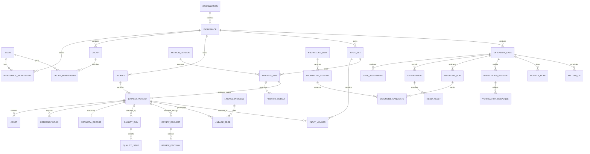

# FAO Climate Geospatial Data & Decision Platform
## 信息架构、核心数据模型、权限矩阵与模块契约

| 项目 | 内容 |
|---|---|
| 文档版本 | 0.1.0 |
| 日期 | 2026-08-28 |
| 状态 | Proposed — for product, data-governance and engineering review |
| 事实基线 | `PROJECT_HANDOFF_CONTEXT_2026-08-28.md` |
| 目标读者 | FAO Climate Change Group、产品负责人、GIS/data steward、开发与运维团队 |

---

## 0. 文档地位与术语

本设计严格区分两类内容：

- **事实基线**：当前可运行的是 Cambodia commune 气候适应型水稻投资与推广优先级空间 DSS MVP；已有上传、版本、质量检查、人工发布、分析 lineage、地图、排名和导出；数据为 111 条合成记录；正式登录、RBAC、审计、通用 raster ingestion、推广员工作流和生产部署尚未实现。
- **目标设计**：本文提出的平台信息架构、数据库领域模型、权限代码和模块契约，均是下一阶段设计，不表示已经完成。

规范关键词：

- **MUST**：为了数据治理、安全或模块可拆分性必须满足；
- **SHOULD**：默认应满足，除非记录了明确例外；
- **MAY**：可按阶段选择实现。

本文不把当前系统称为真实田块级 digital twin。平台正式名称暂定：

> **FAO Climate Geospatial Data & Decision Platform**  
> FAO 气候变化地理空间数据与决策平台

---

# 1. 架构决策摘要

## 1.1 产品形态

平台采用：

> **统一应用壳 + Data Hub 核心 + 多个业务应用模块 + 统一身份、权限、审计和数据治理服务。**

核心原则：

1. **Data Hub 是唯一权威数据目录**。My Data、Team Data、应用输入和应用输出都引用同一套 dataset/version/asset 模型。
2. **业务功能按模块分离**。第一批模块为 `investment-prioritisation` 和 `extension-field-support`；未来 carbon、season planning、policy simulation 等按相同 contract 注册。
3. **应用权限与数据权限分离**。进入某应用，不等于可以读取所有数据；能读取某数据，也不等于能运行或批准某分析。
4. **发布版本不可变**。修正必须创建新版本；被分析或被引用的版本不得物理覆盖。
5. **分析输入、方法和输出均版本化**。每次 run 必须绑定精确 dataset version、method version、参数、代码/容器版本；可复用结果必须登记回 Data Hub 并建立 lineage。
6. **当前采用模块化单体**。一个 React application shell、一个 FastAPI deployment、一个 PostgreSQL/PostGIS cluster、一个 S3-compatible object store；各领域按 route、package、API namespace、database schema 和 permission namespace 隔离。
7. **不同时建立两个权威 catalog**。如以后采用 GeoNode，只能把它定义为唯一 Data Hub 或受控发布适配层，不能与自建目录双主运行。

## 1.2 第一阶段边界

第一阶段 MUST 完成：

- application shell 与 route-level module isolation；
- OIDC-ready identity abstraction；
- organization/workspace/group；
- Data Hub 的 dataset/version/asset/metadata/quality/review/lineage；
- RBAC + resource grant 的后端权限校验；
- upload job 与审计；
- 把现有 prioritisation MVP 迁移为第一个模块且不丢失现有数据；
- 分析输出重新登记为 derived dataset。

第一阶段不要求：

- microservices、microfrontends 或 Kubernetes；
- 田块级实时 digital twin；
- 开放式 LLM 农艺建议；
- 全部 Ashiq HTML 功能；
- 所有 OGC API 一次性实现；
- 全离线推广员系统，但模型和 contract 必须为后续离线预留。

---

# 2. Information Architecture

## 2.1 信息架构目标

信息架构需要同时支持两种完全不同的工作模式：

- **desktop GIS / analysis**：数据查找、版本审查、地图分析、情景比较、结果导出；
- **mobile-first field workflow**：任务列表、现场观察、核查、照片、行动和跟进。

因此平台共享身份和数据底座，但不强迫所有模块使用同一种页面布局。

## 2.2 顶层对象层级

```text
Organization
└── Workspace
    ├── Members / Groups / Role assignments
    ├── Data
    │   ├── Datasets
    │   ├── Dataset versions
    │   ├── Assets / representations
    │   ├── Collections
    │   └── Reviews / quality / lineage
    ├── Enabled applications
    │   ├── Investment & Extension Prioritisation
    │   ├── Extension Officer Field Support
    │   └── Future modules
    └── Governance
        ├── Access policies
        ├── Audit
        ├── Retention
        └── Module configuration
```

### 推荐的 workspace 用法

`Organization` 表示组织边界，例如 FAO Climate Change Group。`Workspace` 表示可授权、可管理和可归档的项目/国家/主题空间，例如：

- Cambodia Rice Resilience；
- Climate Risk；
- Nature-based Solutions；
- Methane and Carbon；
- Regional Data Products。

用户可以属于多个 workspace。数据、分析 run、field case 和应用启用状态必须归属一个 workspace。

## 2.3 全局 Application Shell

### Desktop shell

```text
┌─────────────────────────────────────────────────────────────────┐
│ Product │ Workspace switcher │ Search │ Jobs │ Alerts │ User    │
├───────────────┬─────────────────────────────────────────────────┤
│ Home          │ Context header / breadcrumbs / page actions     │
│ Data          ├─────────────────────────────────────────────────┤
│ Applications  │                                                 │
│ Governance    │                  Page content                   │
│ Help          │                                                 │
└───────────────┴─────────────────────────────────────────────────┘
```

全局 shell MUST 提供：

- workspace switcher；
- 权限感知导航；
- global search；
- upload/processing job 状态；
- notifications；
- locale 和帮助入口；
- 当前用户、角色与退出；
- breadcrumb 与资源级操作菜单。

### Mobile field shell

推广员模块 SHOULD 使用底部导航：

```text
Worklist | New observation | Map | Sync | Profile
```

它仍嵌在统一平台中，但可有独立的 responsive layout、PWA cache 和离线状态栏。

## 2.4 顶级导航与路由

| 顶级入口 | Route | 进入权限 | 说明 |
|---|---|---|---|
| Home | `/home` | authenticated | 角色感知首页 |
| Data Hub | `/data/*` | `data.catalog.enter` | 所有受治理数据入口 |
| Applications | `/apps/*` | 对应 `apps.<module>.use` | 业务模块注册区 |
| Governance | `/governance/*` | 至少一个治理权限 | review、成员、权限、审计和策略 |
| Help | `/help/*` | authenticated | 方法、数据字典、工作流说明 |

导航项 MUST 来自后端 `GET /api/me/capabilities` 或 module registry，不应在前端假设所有用户可见。

## 2.5 Home

Route：`/home`

首页不是固定 dashboard，而是按权限组合：

- 所有人：最近访问的数据、最近通知、平台免责声明；
- contributor：未完成上传和失败 jobs；
- reviewer/publisher：待处理 review queue；
- analyst：最近 runs、失败 runs、常用 input set；
- extension officer：今日任务、逾期跟进、离线待同步记录；
- supervisor：未分配 cases、高优先区域、团队 workload；
- admin：身份同步错误、存储、备份和安全告警。

## 2.6 Data Hub 路由树

```text
/data
├── /catalog                         Team catalogue
├── /mine                            Owned, contributed or followed data
├── /collections                     Curated collections
├── /uploads                         Upload and processing jobs
├── /reviews                         Review queue
├── /datasets/new                    Create dataset
├── /datasets/:datasetId             Dataset detail
│   ├── /overview
│   ├── /versions
│   ├── /metadata
│   ├── /lineage
│   ├── /access
│   └── /activity
└── /datasets/:datasetId/versions/:versionId
    ├── /summary
    ├── /preview
    ├── /files
    ├── /quality
    ├── /review
    ├── /lineage
    └── /download
```

### Team Catalogue

必须支持：

- text、tag、owner、workspace、data kind、status、visibility、classification 筛选；
- spatial extent 和 temporal range 筛选；
- vector/raster/table/document/model output/derived result；
- 最新 published version、更新时间、许可、质量和责任人；
- saved search MAY 后置。

### My Data

不是独立存储。它是 catalog query：

- owned by me；
- uploaded/contributed by me；
- shared directly with me；
- followed by me；
- awaiting my action。

### Dataset Detail

Dataset detail 表示逻辑数据产品，不代表某个文件。建议 tabs：

| Tab | 主要内容 |
|---|---|
| Overview | 描述、owner、steward、当前发布版本、许可、范围、快速预览 |
| Versions | 所有版本、状态、变更说明、是否被引用 |
| Metadata | 数据产品级 metadata 与版本继承规则 |
| Lineage | 来源与下游依赖图 |
| Access | visibility、classification、用户/组授权 |
| Activity | 上传、下载、审查、发布、授权变更审计摘要 |

### Version Detail

Version detail 是复现和审核的核心页面：

- immutable version label；
- source assets 与 standardized representations；
- checksum、大小、格式、CRS、extent；
- automatic quality run；
- human review；
- provenance、licence、time coverage、transformation；
- upstream/downstream lineage；
- download options；
- publish/deprecate/archive 操作。

### Upload wizard

```text
1. Choose/create dataset
2. Describe version and visibility
3. Add source files
4. Map metadata and data profile
5. Upload directly to object storage
6. Processing and validation
7. Review issues
8. Submit for review
```

大文件 MUST 走 direct multipart upload，API 只签发短时效凭证、创建 upload session 和 processing job。

## 2.7 Investment & Extension Prioritisation 模块 IA

Base route：`/apps/investment-prioritisation`

```text
/apps/investment-prioritisation
├── /overview
├── /new-run
├── /input-sets
├── /methods
├── /scenarios
├── /runs
├── /runs/:runId
│   ├── /map
│   ├── /ranking
│   ├── /explanation
│   ├── /sensitivity
│   ├── /lineage
│   └── /export
└── /compare
```

### New run wizard

```text
1. Select study area / project
2. Select exact input dataset versions
3. Validate data-contract compatibility
4. Select approved method version
5. Select scenario or enter permitted parameters
6. Review assumptions and missing data
7. Run
8. Register and review output
```

### Run detail

每个 run MUST 显示：

- run ID、status、owner、timestamps；
- exact inputs and versions；
- method version、code/container digest；
- scenario、weights、thresholds；
- warnings and exclusions；
- map、ranking、area explanation；
- output dataset version；
- lineage and audit；
- “illustrative/not operational” 等适用免责声明。

现有 MVP 的 Analysis、Map、Results 不再是全平台的固定三段，而是此模块内部的 run workflow。

## 2.8 Extension Officer Field Support 模块 IA

Base route：`/apps/extension-field-support`

```text
/apps/extension-field-support
├── /worklist
├── /map
├── /cases
├── /cases/new
├── /cases/:caseId
│   ├── /summary
│   ├── /observations
│   ├── /diagnosis
│   ├── /verification
│   ├── /action
│   ├── /follow-up
│   └── /activity
├── /knowledge
├── /activities
├── /supervision
└── /sync
```

### Case workflow

```text
Assigned / reported case
→ Officer observation
→ Cited candidate causes
→ Field-verification checklist
→ Officer confirmation
→ FFS / demo / individual follow-up
→ Follow-up and closure
→ Approved aggregate feedback to Data Hub
```

关键 UI 原则：

- officer 始终保留确认权；
- diagnosis 页面必须显示 evidence、source、knowledge version、uncertainty 和 missing information；
- LLM 产生的语言不能伪装为 vetted agronomic rule；
- 照片、精确位置和 officer notes 默认不进入普通 Team Catalogue；
- field case 先在受限业务 schema 管理，只有经批准、去标识化或聚合后的数据才注册为共享 dataset；
- offline draft、同步冲突和媒体上传状态必须可见。

## 2.9 Governance IA

```text
/governance
├── /reviews
├── /members
├── /groups
├── /roles
├── /data-policies
├── /quality-profiles
├── /knowledge-approvals
├── /applications
├── /audit
├── /retention
└── /system-health
```

| 页面 | 主要职责 |
|---|---|
| Reviews | metadata、data quality、domain 和 publication queue |
| Members & Groups | workspace membership 与 group 管理 |
| Roles | role bundle、resource grants、temporary access |
| Data Policies | visibility、classification、licence、retention defaults |
| Quality Profiles | 数据类型 contract 和自动检查规则 |
| Knowledge Approvals | 推广知识版本的 editor/approver workflow |
| Applications | 启用模块、module version、workspace config |
| Audit | actor/action/resource/outcome 查询和导出 |
| System Health | 仅 platform admin；jobs、storage、backup、identity sync |

## 2.10 共享能力而非独立一级应用

以下能力 SHOULD 作为共享组件或某模块子功能，不应默认变成顶层菜单：

- map viewer；
- export/report；
- notifications；
- voice input；
- translation；
- file preview；
- geocoding；
- help/knowledge search。

Season planner、carbon tracker、policy simulator 等只有在具备独立用户、决策、数据 contract、方法 owner、权限和维护责任时，才注册为独立模块。

## 2.11 三条关键用户旅程

### A. 数据上传与发布

```text
Contributor creates draft version
→ direct upload to quarantine
→ processing job creates representations
→ automatic quality profile runs
→ contributor fixes or submits review
→ reviewer records decision
→ publisher publishes immutable version
→ version becomes eligible for authorised apps
```

### B. 投资优先级分析

```text
Analyst creates/chooses locked input set
→ selects approved method version and scenario
→ backend checks permission and contracts
→ asynchronous run
→ results stored in investment schema
→ reusable output registered as catalog dataset version
→ lineage connects all inputs, process and output
```

### C. 推广员 case

```text
Officer receives or creates case
→ records offline-capable observation
→ system retrieves approved knowledge versions
→ candidate causes and verification checklist
→ officer confirms or rejects
→ supervisor/office plans action
→ follow-up and closure
→ approved aggregate is optionally published to Data Hub
```

---
# 3. 核心数据模型

## 3.1 领域 schema

建议一个 PostgreSQL/PostGIS cluster，按领域分 schema：

| Schema | 所有权 | 说明 |
|---|---|---|
| `iam` | platform core | 外部身份映射，不保存本地密码 |
| `core` | platform core | organization、workspace、group、module registry、notifications |
| `governance` | governance service | role assignment、resource grant、review policy |
| `catalog` | Data Hub | dataset、version、asset、representation、metadata、quality、lineage |
| `jobs` | job service | upload、ingestion、analysis、export 等异步任务 |
| `audit` | audit service | append-only 审计事件 |
| `investment` | investment module | indicator、method、scenario、input set、run、result |
| `extension` | extension module | case、observation、knowledge、verification、activity |
| `integration` | integration adapters | 外部系统连接配置、同步 cursor 和 mapping |

模块 MUST：

- 只写自己的业务 schema 和共享服务公开接口；
- 不直接修改另一个模块的表；
- 通过 module service/repository 或稳定 read model 读取跨域信息；
- 对可复用输出调用 Catalog API 登记，而不是自行创造另一套 dataset 表。

## 3.2 通用字段与类型

所有主要实体 SHOULD 使用：

```text
id                  UUID / UUIDv7-compatible
workspace_id        UUID，除全局实体外必填
created_at          timestamptz
created_by          UUID
updated_at          timestamptz
updated_by          UUID
row_version         bigint，用于 optimistic locking
```

约定：

- 时间统一存 UTC，UI 按用户 locale/timezone 显示；
- 外部可引用 ID 使用 UUID，不暴露连续主键；
- 状态使用受控 enum/check constraint；
- JSONB 只用于参数、检查 details 和可扩展 metadata，不用来替代所有关系模型；
- geometry/geography 必须记录 CRS；
- object storage locator 不对终端用户永久暴露，下载使用短时效 signed URL；
- 所有安全相关变更同时写 `audit.events`。

## 3.3 身份、组织与 workspace

### `iam.users`

外部 IdP 用户镜像，不保存密码。

| 字段 | 说明 |
|---|---|
| `id` | 内部 UUID |
| `external_subject` | OIDC `sub`，唯一 |
| `issuer` | IdP issuer |
| `email` | 规范化 email |
| `display_name` | 显示名称 |
| `status` | `active/disabled/pending` |
| `locale` | `en/km/...` |
| `last_login_at` | 最近登录 |

唯一约束：`(issuer, external_subject)`。

### `core.organizations`

| 字段 | 说明 |
|---|---|
| `id`, `slug`, `name` | 组织标识 |
| `classification_policy_id` | 默认数据分类策略 |
| `status` | active/archived |

### `core.workspaces`

| 字段 | 说明 |
|---|---|
| `organization_id` | 所属组织 |
| `slug`, `name`, `description` | workspace 信息 |
| `country_codes` | 可为空，多国项目可多个 |
| `default_visibility` | 新资源默认 visibility |
| `default_classification` | 新资源默认 classification |
| `status` | active/frozen/archived |

唯一约束：`(organization_id, slug)`。

### `core.workspace_memberships`

| 字段 | 说明 |
|---|---|
| `workspace_id`, `user_id` | 复合唯一 |
| `status` | invited/active/suspended/left |
| `joined_at`, `expires_at` | 成员有效期 |
| `invited_by` | 邀请人 |

### `core.groups` / `core.group_memberships`

Group 属于 workspace，可用于项目团队、data steward、review board、extension officers 等。Group membership 和 role assignment 分开，便于一个 group 获得多个 role bundle。

### `core.modules`

模块 registry：

| 字段 | 说明 |
|---|---|
| `module_key` | 如 `investment-prioritisation` |
| `name`, `description` | 显示信息 |
| `contract_version` | module contract 版本 |
| `module_version` | 实现版本 |
| `manifest` | 已验证 manifest JSONB |
| `status` | installed/enabled/disabled/retired |

### `core.workspace_modules`

记录某 workspace 是否启用模块、配置版本和功能 flags。模块安装不表示所有 workspace 自动启用。

## 3.4 Catalog：逻辑数据产品、版本、文件与表示

### `catalog.datasets`

逻辑数据产品，例如 “Cambodia commune boundaries”。

| 字段 | 说明 |
|---|---|
| `workspace_id` | 所属 workspace |
| `slug`, `title`, `abstract` | 数据产品标识与说明 |
| `data_kind` | vector/raster/table/document/multidimensional/model_output/derived_product |
| `owner_user_id` | 业务 owner |
| `steward_group_id` | 数据治理责任组 |
| `visibility` | private/restricted/workspace/team/fao_internal/public |
| `classification` | public/fao_internal/restricted/sensitive_field |
| `lifecycle_status` | active/frozen/archived |
| `current_published_version_id` | 便捷引用，不替代版本关系 |
| `default_quality_profile_id` | 默认质量规则 |
| `licence_code` | 产品级默认许可，可由版本覆盖 |

约束：`(workspace_id, slug)` 唯一。

### `catalog.dataset_versions`

一个数据产品的不可变快照。

| 字段 | 说明 |
|---|---|
| `dataset_id` | 父 dataset |
| `version_label` | 人类可读版本，如 `2026.1` |
| `state` | lifecycle 状态 |
| `change_summary` | 与上一版差异 |
| `supersedes_version_id` | 可选上一版本 |
| `metadata_snapshot` | 发布时完整 metadata 快照 |
| `created_by`, `created_at` | 创建信息 |
| `submitted_at`, `approved_at`, `published_at` | workflow timestamps |
| `approved_by`, `published_by` | 决策人 |
| `deprecated_at`, `archived_at` | 后续状态 |

建议生命周期：

```text
DRAFT
→ UPLOADING
→ PROCESSING
→ VALIDATION_FAILED | VALIDATED
→ IN_REVIEW
→ CHANGES_REQUESTED | APPROVED
→ PUBLISHED
→ DEPRECATED
→ ARCHIVED
```

规则：

1. `PUBLISHED` 后业务字段、assets 和 representations MUST immutable；
2. 更正必须创建新 version；
3. 被 analysis、collection 或 lineage 引用的 version 不允许物理删除；
4. `DEPRECATED` 仍可复现历史 run，但默认不供新 run 选择；
5. `ARCHIVED` 表示不在普通目录显示，不等于删除底层对象；
6. 同一 dataset 的 `version_label` 唯一；
7. 同一时刻可有多个 published 版本，但只有一个 `current_published_version_id`。

### `catalog.assets`

实际对象存储文件。

| 字段 | 说明 |
|---|---|
| `dataset_version_id` | 所属版本 |
| `role` | source/data/metadata/style/thumbnail/report/auxiliary |
| `filename`, `object_key` | 原文件名和对象路径 |
| `media_type`, `size_bytes` | 文件类型与大小 |
| `sha256` | checksum |
| `upload_session_id` | 来源上传 session |
| `scan_status` | pending/clean/quarantined/rejected |
| `storage_class` | standard/archive 等 |
| `encryption_context` | 可选加密标识 |

约束：同一 version 内 `(sha256, role)` SHOULD 去重。

### `catalog.representations`

同一 version 可有多种可查询/可视化表示。

| 字段 | 示例 |
|---|---|
| `representation_type` | postgis_table/cog/geoparquet/zarr/vector_tiles/stac_item/download_package |
| `locator` | table name、object key 或 service identifier |
| `status` | building/ready/failed/retired |
| `crs` | `EPSG:4326` |
| `geometry_type` | MultiPolygon/Point 等 |
| `bbox` | PostGIS geometry |
| `temporal_start/end` | 可选 |
| `resolution` | raster/temporal resolution |
| `schema_json` | fields/bands/dimensions |
| `statistics_json` | 可选统计摘要 |

资产与表示的区别：GeoTIFF 是 asset；由它标准化生成的 COG 是另一 asset，同时有一条 `cog` representation 指向该 asset。

## 3.5 Metadata

### `catalog.metadata_records`

建议每个 dataset version 有一条完整 metadata snapshot，至少包括：

- title、abstract、purpose；
- producer/source organization；
- responsible contact；
- provenance；
- licence 和 use limitation；
- temporal coverage；
- spatial extent、CRS、resolution/scale；
- creation/update frequency；
- methodology/transformation summary；
- quality statement；
- keywords、language；
- personal/sensitive data declaration；
- citation；
- external identifier 和 source URL（如允许）。

Dataset 级 metadata 可作为 draft 默认值，但发布时 MUST 固化到 version snapshot，避免未来修改破坏历史复现。

### `catalog.metadata_contacts`

支持 owner、point_of_contact、processor、publisher、custodian 等责任角色，不把责任人只存成自由文本。

## 3.6 Collections

### `catalog.collections`

Collection 是逻辑集合，不复制文件，可用于：

- project data package；
- thematic collection；
- approved analysis input collection；
- publication series。

### `catalog.collection_members`

成员可指向 dataset 或精确 dataset version。正式 analysis input SHOULD 指向 version，而不是浮动 latest。

## 3.7 Quality 与 Review

### `catalog.quality_profiles`

版本化质量规则，例如：

- admin-boundary.v1；
- normalised-indicator-layer.v1；
- cog-raster.v1；
- extension-aggregate.v1。

字段包括 profile key/version、适用 data kind、required fields/bands、CRS、geometry、value range、validation rules 和 severity policy。

### `catalog.quality_runs`

| 字段 | 说明 |
|---|---|
| `dataset_version_id` | 被检查版本 |
| `quality_profile_id` | 使用的规则版本 |
| `engine_version` | 检查器版本 |
| `status` | queued/running/passed/warning/failed |
| `started_at/completed_at` | 运行时间 |
| `summary_json` | 统计摘要 |

### `catalog.quality_issues`

| 字段 | 说明 |
|---|---|
| `quality_run_id` | 父 run |
| `code`, `name` | 稳定问题代码 |
| `severity` | info/warning/error/blocking |
| `affected_count` | 受影响记录数 |
| `location_ref` | row/feature/band/object reference |
| `details_json` | 结构化细节 |
| `resolution_status` | open/accepted/fixed/not_applicable |

### `catalog.review_requests`

一个 version 可有 metadata、technical、domain、publication 等 review type。

| 字段 | 说明 |
|---|---|
| `dataset_version_id` | 被审查版本 |
| `review_type` | metadata/technical/domain/publication |
| `requested_by`, `requested_at` | 请求信息 |
| `reviewer_group_id` | 默认责任组 |
| `status` | open/in_progress/approved/changes_requested/rejected/cancelled |
| `policy_snapshot` | 当时适用的 separation-of-duties 规则 |

### `catalog.review_decisions`

保存 reviewer、decision、rationale、checklist snapshot、timestamp。禁止覆盖旧 decision；新的决定追加记录。

## 3.8 Lineage

### `catalog.lineage_processes`

描述产生或转换数据的过程：

| 字段 | 说明 |
|---|---|
| `process_type` | upload/ingestion/transform/analysis/import/manual |
| `module_key` | 产生过程的模块 |
| `external_run_type/id` | 如 investment analysis run |
| `method_identifier/version` | 方法版本 |
| `code_ref` | Git commit/tag |
| `container_digest` | 可选容器 digest |
| `parameters_json` | 固化参数 |
| `started_at/completed_at` | 时间 |
| `status` | succeeded/failed/cancelled |

### `catalog.lineage_edges`

| 字段 | 说明 |
|---|---|
| `process_id` | 过程 |
| `direction` | input/output |
| `dataset_version_id` | 精确版本 |
| `role` | boundary/indicator/result/report 等 |
| `ordinal` | 顺序 |

这样形成：

```text
input version(s) → lineage process → output version(s)
```

每个可复用 derived dataset MUST 至少有一个 output edge，并能回溯所有直接输入。

## 3.9 Jobs 与 Upload Sessions

### `jobs.upload_sessions`

记录 multipart upload、预期文件、过期时间、workspace、dataset/version、创建人和状态。

### `jobs.processing_jobs`

| 字段 | 说明 |
|---|---|
| `job_type` | ingest_vector/build_cog/run_analysis/export 等 |
| `module_key` | 发起模块 |
| `resource_type/id` | 关联资源 |
| `status` | queued/running/waiting_user/succeeded/failed/cancelled |
| `progress` | 0–100 |
| `idempotency_key` | 防止重复提交 |
| `payload_json`, `result_json` | 请求和结果摘要 |
| `attempt`, `max_attempts` | 重试 |
| `error_code/message` | 失败信息 |
| `requested_by`, timestamps | 审计信息 |

### `jobs.job_steps`

细化为 upload、virus scan、inspect、validate、convert、index、preview、register 等步骤。用户页面显示 step 状态，但内部日志不可泄漏 secrets。

## 3.10 Audit

### `audit.events`

Append-only，不允许普通应用 UPDATE/DELETE。

| 字段 | 说明 |
|---|---|
| `event_time` | 时间 |
| `actor_type/id` | user/service |
| `workspace_id` | 上下文 |
| `action` | 如 `dataset.version.publish` |
| `resource_type/id` | 资源 |
| `outcome` | success/denied/failure |
| `reason` | 用户理由或系统原因 |
| `correlation_id` | 串联一次请求/job |
| `ip_hash/user_agent` | 按政策保留 |
| `before_json/after_json` | 受控 diff，敏感字段需脱敏 |

必须审计：登录、授权变更、上传、下载、review、publish、deprecate、archive、run、export、case 查看、媒体访问、knowledge approval、break-glass。

## 3.11 Investment 模块模型

### `investment.indicator_definitions`

| 字段 | 说明 |
|---|---|
| `code` | 稳定代码，如 `drought_risk` |
| `title`, `description` | 业务定义 |
| `unit` | 单位 |
| `direction` | higher_is_priority/lower_is_priority/custom |
| `expected_profile` | 输入 data contract |
| `owner_group_id` | 指标 owner |
| `status` | draft/approved/retired |

### `investment.method_definitions` / `investment.method_versions`

Method definition 是逻辑方法；method version 固化：

- required indicator roles；
- normalisation；
- missing-value policy；
- weighting rules；
- eligibility rules；
- banding；
- uncertainty/sensitivity behavior；
- code ref/container digest；
- validation evidence；
- approver and date；
- disclaimer template。

只有 `approved` method version 可用于非 sandbox run。

### `investment.scenarios` / `investment.scenario_parameters`

Scenario 绑定 method version。权重不是写死前端常量，而是 versioned parameters。Scenario 状态为 draft/approved/retired。

### `investment.analysis_input_sets`

一个锁定的输入集合：

| 字段 | 说明 |
|---|---|
| `workspace_id`, `name`, `label` | 识别 |
| `study_area_ref` | 可选行政区/geometry |
| `status` | draft/locked/retired |
| `created_by`, `locked_at` | 生命周期 |

### `investment.analysis_input_members`

| 字段 | 说明 |
|---|---|
| `input_set_id` | 父集合 |
| `dataset_version_id` | 精确输入版本 |
| `input_role` | boundary/yield_gap/drought/etc. |
| `join_key` | 聚合或 join key |
| `required` | 是否必需 |
| `transform_config` | 明确的聚合/重采样配置 |

锁定 input set 后成员不可变。需要变更时 clone 为新 input set。

### `investment.analysis_runs`

| 字段 | 说明 |
|---|---|
| `input_set_id` | 锁定输入集合 |
| `method_version_id` | 精确方法版本 |
| `scenario_id` | 可选场景 |
| `parameters_snapshot` | 最终参数，包括用户 override |
| `status` | queued/running/succeeded/failed/cancelled |
| `requested_by` | analyst |
| `code_ref/container_digest` | 实际执行版本 |
| `output_dataset_version_id` | 登记后的结果版本 |
| `started_at/completed_at` | 时间 |
| `warnings_json`, `failure_json` | 运行结果 |

### `investment.analysis_run_inputs`

即使 input set 已锁定，run 仍保存一份精确 input snapshot，便于独立审计。

### `investment.priority_results`

继续支持交互查询：run × area 的 score、rank、eligible、band、contributions、missing indicators。它是模块内部读模型；权威可下载结果仍通过 output dataset version/representation 发布。

### `investment.run_comparisons`

保存用户明确创建的 comparison，不因打开页面自动生成新的分析 run。

## 3.12 Extension 模块模型

### `extension.cases`

| 字段 | 说明 |
|---|---|
| `workspace_id`, `case_number` | 工作空间内唯一编号 |
| `status` | new/assigned/in_observation/in_verification/action_planned/follow_up/closed/cancelled |
| `priority` | low/normal/high/urgent |
| `confidentiality` | restricted/sensitive_field |
| `location` | geography point/polygon，可按权限降精度 |
| `admin_area_version_id` | 使用的行政区版本 |
| `crop`, `growth_stage` | 受控词表 |
| `severity`, `affected_area` | 现场信息 |
| `summary` | 简短描述 |
| `reported_by`, `current_assignee_id` | 人员 |
| `opened_at`, `closed_at` | 生命周期 |

### `extension.case_assignments`

保留分配历史；officer 仅凭当前 assignment 和授权访问 case。

### `extension.observations`

| 字段 | 说明 |
|---|---|
| `case_id`, `observed_by`, `observed_at` | 基本信息 |
| `form_version` | 表单 schema 版本 |
| `values_json` | 结构化观察 |
| `notes` | officer note |
| `location` | 可与 case location 不同 |
| `offline_client_id` | 客户端幂等 ID |
| `sync_state`, `server_revision` | 离线同步 |

Observation 发布后不原地覆盖；修订追加新记录并关联 supersedes observation。

### `extension.media_assets`

case/observation 媒体使用受限 object prefix，记录 checksum、media type、capture time、consent、EXIF stripping、malware scan、classification 和访问策略。不得自动成为普通 catalog asset。

### `extension.knowledge_items` / `extension.knowledge_versions`

Knowledge item 是主题；version 固化内容、语言、适用作物/阶段/地区、来源、限制、审查状态和 approver。状态：draft/in_review/approved/retired。

### `extension.knowledge_sources`

每条实质规则或建议必须能引用一个或多个 source；保存引用标识、标题、机构、日期、许可和 source locator。系统生成文本要保存引用到具体 knowledge version，而不是只存自由文本答案。

### `extension.diagnosis_runs`

| 字段 | 说明 |
|---|---|
| `case_id` | case |
| `observation_snapshot` | 使用的 observation IDs |
| `ruleset_version` | 规则版本 |
| `knowledge_version_ids` | 使用的 approved knowledge |
| `language_model_ref` | 可为空；仅语言层 |
| `status` | generated/confirmed/rejected/superseded |
| `confirmed_by/at` | officer 决定 |

### `extension.diagnosis_candidates`

rank、candidate code、score/rationale、supporting evidence、missing information、verification questions、knowledge version references。不得只保存最终自然语言。

### `extension.verification_template_versions` / `verification_items`

版本化核查模板；每个 item 说明 question、response type、candidate discrimination logic、required evidence。

### `extension.verification_sessions` / `verification_responses`

记录某次现场核查使用的 template version、officer、时间、回答和证据。完成后可触发新 diagnosis run，而不覆盖旧 run。

### `extension.activity_plans` / `activity_steps`

FFS、demo、individual follow-up 等行动计划，包含目标、受众、材料、步骤、消息、负责人、时间、地点、批准状态和知识版本引用。

### `extension.follow_ups`

due date、owner、outcome、next action、closure evidence。

### `extension.case_status_history`

Append-only case 状态变化及理由。

## 3.13 数据分类与可见性

两者不能混为一谈：

### Visibility

```text
PRIVATE       owner only
RESTRICTED    named users/groups
WORKSPACE     all authorised workspace members
TEAM          organization/team scope
FAO_INTERNAL  approved internal identity scope
PUBLIC        public release
```

### Classification

```text
PUBLIC
FAO_INTERNAL
RESTRICTED
SENSITIVE_FIELD
```

资源 visibility 决定“共享给谁”，classification 决定“允许共享到哪里、需要什么保护”。例如 `SENSITIVE_FIELD` 不允许设置为 PUBLIC，即使 owner 请求。

## 3.14 对象存储布局

推荐逻辑前缀：

```text
quarantine/{workspace_id}/{upload_session_id}/...
catalog/{workspace_id}/datasets/{dataset_id}/versions/{version_id}/source/...
catalog/{workspace_id}/datasets/{dataset_id}/versions/{version_id}/derived/...
extension/{workspace_id}/cases/{case_id}/media/...
exports/{workspace_id}/{job_id}/...
```

规则：

- quarantine 与 published data 分 prefix/bucket policy；
- extension media 与普通 catalog assets 分开；
- object key 不包含用户提供的敏感名称；
- published asset 开启 object versioning/retention（取决于生产存储能力）；
- database 和 object store backup 必须保持一致性并定期做 restore drill。

## 3.15 核心关系图



## 3.16 从当前 MVP 的迁移映射

| 当前表/对象 | 目标 | 迁移说明 |
|---|---|---|
| `data_catalog_items` | `catalog.datasets` | 保留 ID mapping、slug、name、description、owner |
| `data_versions` | `catalog.dataset_versions` + `catalog.assets` | file/object/checksum 移至 asset；状态映射后保留原 version |
| `data_quality_checks` | `catalog.quality_runs/issues` | 为每个旧 version 建一个 legacy quality run |
| `admin_areas` | legacy PostGIS representation 或 `investment` read model | 第一阶段不拆散数据，先保持现有结果可运行 |
| `indicator_values` | legacy analysis-ready representation；以后转独立 indicator datasets | 不在迁移时改变数值 |
| 遗留 `datasets` 指标来源表 | `investment.indicator_definitions`/metadata source | 重命名以避免与 catalog dataset 混淆 |
| `analysis_runs` | `investment.analysis_runs` | 补 method version=`legacy-wlc-1.0`、input snapshot、code ref |
| `priority_results` | `investment.priority_results` | 保留所有 run/result；后续为每个重要 run 可补登记 output dataset |
| MinIO object key | `catalog.assets.object_key` | 原路径可继续使用，不必立即移动对象 |

迁移 MUST：

- 在修改前建立 Git repository、数据库备份和 object-store inventory；
- 不覆盖 synthetic `1.0.0`；
- 记录 old ID → new UUID mapping；
- 对 checksum、record count、run count 和 result count 做迁移后对账；
- 在新模块 run 与旧 run 上做回归结果比较；
- 不执行 `docker compose down -v`。

---
# 4. 权限模型与权限矩阵

## 4.1 模型：RBAC + ABAC + Resource Grants

单纯 RBAC 不足以表达“只能看自己的数据”“只能看被分配的 case”“敏感照片不能跨项目下载”。建议：

- **RBAC**：role bundle 提供默认 action 集合；
- **ABAC**：根据 workspace membership、resource owner、assignment、classification、status、时间和 review policy 判断；
- **Resource Grant**：对具体 dataset/case/user/group 的显式 allow/deny；
- **Application Entitlement**：决定模块入口和模块 API 是否可用。

后端 MUST 对每个请求进行授权；前端隐藏按钮只改善体验，不构成安全控制。

## 4.2 授权计算顺序

建议判定逻辑：

```text
1. identity active?
2. workspace membership active and not expired?
3. module installed and enabled in workspace?
4. user/group has apps.<module>.use when action belongs to module?
5. resource classification compatible with user/context?
6. explicit DENY exists? → deny
7. visibility/resource grant/ownership/assignment permits access?
8. role bundle contains requested action?
9. resource state allows action? e.g. published version cannot edit
10. separation-of-duties and policy constraints pass?
→ allow; otherwise deny and audit sensitive denials
```

默认拒绝（default deny）。任何 break-glass 必须有限时、写理由、通知安全/治理责任人并产生高等级 audit event。

## 4.3 角色不是职位，而是可组合 role bundle

| Role key | 主要用途 |
|---|---|
| `platform_admin` | 全平台技术管理；不默认成为所有数据的业务 owner |
| `workspace_admin` | 管理 workspace 成员、groups、应用启用和默认策略 |
| `data_owner` | 对指定 datasets 承担责任、共享和生命周期管理 |
| `contributor` | 创建 dataset、上传新版本、修复 metadata |
| `data_reviewer` | 技术/metadata/domain review |
| `data_publisher` | 在 review 通过后正式发布或 deprecate |
| `analyst` | 配置并运行获授权的分析，查看和导出结果 |
| `viewer` | 查看 metadata/preview/download 获授权数据 |
| `extension_officer` | 创建/更新自己或被分配的 field cases |
| `extension_supervisor` | 查看 workspace cases、分配、审核行动和 workload |
| `knowledge_editor` | 创建和修改 agronomic knowledge draft |
| `knowledge_approver` | 审批 knowledge version；不能批准自己的版本 |
| `auditor` | 只读访问 audit、review evidence 和 lineage |

一个用户可同时拥有多个 role。例如 GIS analyst 可同时是 contributor + analyst；但 publisher 不应因为兼任 contributor 就能自动批准自己上传的版本。

## 4.4 Permission namespace

### 平台和 workspace

```text
platform.admin
workspace.view
workspace.manage_settings
workspace.manage_members
workspace.manage_groups
workspace.manage_roles
workspace.enable_modules
workspace.view_audit
```

### 应用入口

```text
apps.investment.use
apps.investment.manage_methods
apps.investment.approve_methods
apps.extension.use
apps.extension.supervise
apps.extension.manage_knowledge
apps.extension.approve_knowledge
```

### Data Hub

```text
data.catalog.enter
dataset.create
dataset.view_metadata
dataset.preview
dataset.download
dataset.edit_metadata
dataset.upload_version
dataset.submit_review
dataset.review
dataset.publish
dataset.manage_access
dataset.deprecate
dataset.archive
dataset.delete_unpublished
collection.create
collection.manage
lineage.view
quality.manage_profiles
```

### Investment

```text
investment.input_set.create
investment.input_set.lock
investment.run.create
investment.run.view
investment.run.export
investment.run.cancel
investment.run.compare
investment.result.submit_review
investment.method.edit
investment.method.approve
investment.scenario.edit
investment.scenario.approve
```

### Extension

```text
extension.case.create
extension.case.view_assigned
extension.case.view_workspace
extension.case.update_assigned
extension.case.assign
extension.case.change_priority
extension.case.close
extension.observation.create
extension.media.upload
extension.media.view_sensitive
extension.diagnosis.run
extension.diagnosis.confirm
extension.verification.complete
extension.activity.plan
extension.activity.approve
extension.followup.manage
extension.knowledge.edit
extension.knowledge.review
extension.knowledge.approve
extension.aggregate.publish
```

### Audit and operations

```text
audit.view
audit.export
jobs.view_own
jobs.view_workspace
jobs.retry
system.health.view
system.storage.manage
```

## 4.5 Data Hub 默认矩阵

符号：`✓` 默认允许；`Own` 仅自己拥有/创建的资源；`Assigned` 显式分配；`WS` workspace 范围；`—` 默认不允许。Resource grant、classification 和状态仍可能进一步收紧。

| Action | Platform admin | Workspace admin | Data owner | Contributor | Reviewer | Publisher | Analyst | Viewer | Auditor |
|---|---:|---:|---:|---:|---:|---:|---:|---:|---:|
| Enter catalog | ✓ | ✓ | ✓ | ✓ | ✓ | ✓ | ✓ | ✓ | ✓ |
| View metadata | WS* | WS | Own/granted | granted | review scope | review scope | granted | granted | audit scope |
| Preview | WS* | granted | Own/granted | Own/granted | review scope | review scope | granted | granted | evidence only |
| Download | WS* | granted | Own/granted | Own/granted | review scope | review scope | granted | granted | evidence only |
| Create dataset | —* | ✓ | ✓ | ✓ | — | — | — | — | — |
| Edit metadata | —* | policy | Own | Own/contributed | comments only | — | — | — | — |
| Upload version | —* | policy | Own | Own/granted | — | — | — | — | — |
| Submit review | —* | policy | Own | Own/granted | — | — | — | — | — |
| Review version | —* | assign | — | — | Assigned | read | — | — | read |
| Publish version | break-glass | policy | — | — | — | Assigned/WS | — | — | read |
| Manage access | break-glass | WS | Own | — | — | — | — | — | read |
| Deprecate | break-glass | policy | request | — | recommend | ✓ | — | — | read |
| Archive dataset | break-glass | policy | request | — | — | ✓ | — | — | read |
| Delete unpublished | break-glass | policy | Own + unreferenced | Own + unreferenced | — | — | — | — | read |
| View lineage | WS* | WS | granted | granted | ✓ | ✓ | ✓ | ✓ | ✓ |
| View audit | ✓ | WS | Own resources | Own actions | review scope | publish scope | own runs | — | ✓ |

`WS*`：platform admin 具备技术访问能力，但生产政策 SHOULD 要求显式 support session 或 break-glass，不把“技术管理员”自动等同为所有业务数据 viewer。

## 4.6 Investment 默认矩阵

| Action | Workspace admin | Method owner/editor | Method approver | Analyst | Data reviewer | Publisher | Viewer | Auditor |
|---|---:|---:|---:|---:|---:|---:|---:|---:|
| Enter module | policy | ✓ | ✓ | ✓ | ✓ | ✓ | granted | read |
| View runs | WS | own scope | WS | Own/granted | review scope | output scope | granted | ✓ |
| Create input set | policy | ✓ | — | ✓ | — | — | — | — |
| Lock input set | policy | ✓ | — | ✓ | — | — | — | — |
| Create run | policy | sandbox | — | ✓ | — | — | — | — |
| Cancel running run | policy | own | — | Own | — | — | — | — |
| Export result | policy | granted | granted | Own/granted | review scope | output scope | granted | evidence |
| Compare runs | policy | ✓ | ✓ | ✓ | ✓ | ✓ | granted | ✓ |
| Edit method draft | — | ✓ | — | — | — | — | — | — |
| Approve method | policy | — | ✓ | — | — | — | — | read |
| Edit scenario draft | policy | ✓ | — | allowed custom draft | — | — | — | — |
| Approve scenario | policy | — | ✓ | — | — | — | — | read |
| Submit result dataset | policy | — | — | Own run | — | — | — | — |
| Review result dataset | assign | — | — | — | Assigned | read | — | read |
| Publish result dataset | policy | — | — | — | — | Assigned | — | read |

正式 run MUST 使用 approved method version；analyst 的临时参数 override 是否允许，由 method policy 定义并固化到 run snapshot。

## 4.7 Extension 默认矩阵

| Action | Workspace admin | Officer | Supervisor | Knowledge editor | Knowledge approver | Auditor |
|---|---:|---:|---:|---:|---:|---:|
| Enter module | policy | ✓ | ✓ | ✓ | ✓ | read scope |
| View assigned case | policy | Assigned/Own | WS | no case by default | no case by default | evidence scope |
| View all workspace cases | policy | — | ✓ | — | — | policy |
| Create case | policy | ✓ | ✓ | — | — | — |
| Update case | policy | Assigned/Own | ✓ | — | — | — |
| Assign/reassign | policy | — | ✓ | — | — | — |
| Change priority | policy | recommend | ✓ | — | — | — |
| Close case | policy | request/own policy | ✓ | — | — | — |
| Create observation | policy | Assigned/Own | ✓ | — | — | — |
| Upload media | policy | Assigned/Own | ✓ | — | — | — |
| View sensitive media | break-glass | Assigned/Own | policy | — | — | policy + reason |
| Run candidate diagnosis | policy | Assigned/Own | ✓ | — | — | read evidence |
| Confirm/reject diagnosis | — | Assigned/Own | supervisor override | — | — | read |
| Complete verification | — | Assigned/Own | ✓ | — | — | read |
| Plan activity | policy | Own case | ✓ | — | — | — |
| Approve activity | policy | — | ✓ | — | — | read |
| Edit knowledge draft | — | field feedback only | — | ✓ | — | — |
| Review knowledge | policy | — | expert feedback | assigned | ✓ | read |
| Approve knowledge | policy | — | — | — | ✓ | read |
| Publish aggregate dataset | policy | — | request | — | policy | read |

## 4.8 Separation of Duties

默认策略：

1. 上传者/版本创建者不得作为该版本唯一 reviewer；
2. reviewer 不自动拥有 publish 权限；
3. publisher 只能发布没有 blocking issue 且 review 已批准的版本；
4. method editor 不得批准自己的 method version；
5. knowledge editor 不得批准自己的 knowledge version；
6. analyst 不得把自己的分析结果直接标为正式发布数据；
7. supervisor 的 override 必须写理由；
8. platform admin 的 break-glass 不得静默执行。

Pilot workspace MAY 在人员不足时允许同一人承担多角色，但系统仍需记录两次独立 action 和明确 exception reason。

## 4.9 Resource Grant

### `governance.role_assignments`

```text
subject_type: user | group
subject_id
role_key
scope_type: organization | workspace | dataset | application
scope_id
valid_from / valid_until
assigned_by
reason
```

### `governance.permission_grants`

用于具体例外：

```text
subject_type: user | group
resource_type: dataset | dataset_version | collection | case | module
resource_id
permission_code
effect: allow | deny
expires_at
created_by
reason
```

显式 deny 优先。临时 grant SHOULD 有到期时间。

## 4.10 Row-Level Security 建议

PostgreSQL RLS MAY 作为敏感领域第二道保护，优先用于：

- `extension.cases`；
- `extension.observations`；
- `extension.media_assets` metadata；
- 含个人或精确位置的受限 dataset representation。

应用仍必须做 service-layer authorization；RLS 不是替代品。连接池需安全设置 request-scoped user/workspace context，并测试 context 泄漏。

---
# 5. 模块 Contract

## 5.1 目的

“每个大类一个页面”只能解决导航问题。模块 contract 用来保证未来能够独立开发、启用、升级、授权，必要时再拆成单独服务。

每个模块 MUST 声明：

1. 身份和 owner；
2. 前端 routes；
3. API namespace；
4. database schema 和 object prefix；
5. 进入权限与 action permissions；
6. 接受的 input data profiles；
7. 产生的 output data profiles；
8. jobs；
9. emitted/consumed events；
10. audit actions；
11. security classification、personal data 和 retention；
12. i18n/offline 能力；
13. dependencies、feature flags、observability 和 test obligations。

## 5.2 命名约定

| 项目 | 约定 | 示例 |
|---|---|---|
| Module key | kebab-case | `investment-prioritisation` |
| Frontend base | `/apps/{module-key}` | `/apps/investment-prioritisation` |
| API base | `/api/apps/{module-key}/v1` | `/api/apps/investment-prioritisation/v1` |
| DB schema | snake_case 简名 | `investment` |
| Permission | domain.action | `investment.run.create` |
| Event | domain.entity.action.vN | `investment.analysis.completed.v1` |
| Job type | module:verb-noun:vN | `investment:run-prioritisation:v1` |
| Data profile | kebab-case + version | `priority-ranking@1.0` |

## 5.3 Manifest 顶层结构

```yaml
contract_version: "1.0"
module: {}
ownership: {}
routes: []
api: {}
permissions: {}
data: {}
persistence: {}
jobs: []
events: {}
audit: []
security: {}
i18n: {}
offline: {}
feature_flags: []
dependencies: []
observability: {}
testing: {}
compatibility: {}
```

机器可验证 schema 见交付包中的 `module-contract.schema.json`。

## 5.4 Module identity 与 ownership

必须字段：

```yaml
module:
  key: investment-prioritisation
  name: Investment & Extension Prioritisation
  version: 1.0.0
  status: beta
  description: ...
ownership:
  product_owner: fao-climate-change
  technical_owner: platform-engineering
  data_owner_groups:
    - climate-data-stewards
  method_owner_groups:
    - investment-method-board
  support_contact: ...
```

没有明确 product owner 和 method/content owner 的功能，不应进入 production-enabled 状态。

## 5.5 Route contract

每条 route 声明：

- path；
- title；
- navigation position；
- required permissions；
- optional feature flag；
- layout `desktop/mobile/adaptive`；
- offline capability；
- breadcrumb label；
- deep-link stability。

例：

```yaml
routes:
  - path: /apps/investment-prioritisation/runs/:runId
    title: Analysis run
    permissions: [apps.investment.use, investment.run.view]
    layout: desktop
    offline_capable: false
```

Module 不得注册与 core route 冲突的路径。

## 5.6 API contract

规则：

1. API base MUST versioned；
2. OpenAPI tags 必须按 module；
3. mutation 支持 `Idempotency-Key`，尤其是 create run、upload、offline sync；
4. list API 使用统一 pagination/filter/sort；
5. errors 使用稳定 code，而不只返回自由文本；
6. 每个响应包含或传播 `correlation_id`；
7. long-running action 返回 job/run resource，不占用 HTTP connection；
8. export 和大文件使用 job + signed URL；
9. module API 不直接返回 object-store permanent credentials；
10. API 必须再次验证 module entitlement 和 resource permission。

统一错误示例：

```json
{
  "error": {
    "code": "DATA_CONTRACT_MISMATCH",
    "message": "Selected drought layer does not satisfy normalised-indicator-layer@1.0",
    "details": {"dataset_version_id": "...", "failed_rules": ["value_range"]},
    "correlation_id": "..."
  }
}
```

## 5.7 Data contract profiles

Module 不应按文件名或隐含列名猜测输入。每个 input profile SHOULD 定义：

- profile key/version；
- data kind；
- required metadata；
- geometry/dimensions；
- CRS policy；
- required fields/bands；
- units；
- value domain；
- temporal/spatial compatibility；
- allowed version states；
- quality profile；
- optional transform rules；
- compatibility policy。

建议首批 profiles：

| Profile | 用途 |
|---|---|
| `administrative-boundary@1.0` | 行政边界，稳定 code/name/level/geometry |
| `normalised-indicator-layer@1.0` | 0–1、方向声明、单位和时间尺度明确的指标 |
| `analysis-ready-priority-bundle@1.0` | 兼容现有完整 bundle 的过渡 profile |
| `priority-ranking@1.0` | 区域 score/rank/band/contribution 输出 |
| `approved-agronomic-knowledge@1.0` | 已批准、可引用、带来源的知识版本 |
| `extension-case-aggregate@1.0` | 去标识化或聚合后的 field observation 输出 |

### 输入选择模式

```yaml
selection_mode: exact_version
allowed_states: [published]
```

正式 run 不得使用浮动 `latest`。Sandbox MAY 允许 validated draft，但必须明确标记且输出不可直接发布。

## 5.8 Output contract

每个可复用输出声明：

- 是否登记到 catalog；
- dataset/profile；
- 默认 visibility/classification；
- required review；
- retention；
- lineage required；
- representations；
- disclaimer；
- whether sensitive/raw output may remain module-internal。

Investment result 默认：登记为 `derived_product`、workspace visibility、restricted/FAO internal classification、publication review required。

Extension raw case 默认：不登记为普通 catalog dataset；只有 approved aggregate 才登记。

## 5.9 Persistence contract

模块声明：

```yaml
persistence:
  database_schema: investment
  cross_schema_writes: false
  object_prefixes:
    - catalog/{workspace_id}/...
  migrations:
    tool: alembic
    ownership: module
```

规则：

- schema migration 由 Alembic 管理；
- migration 必须可在 staging restore 上测试；
- module 不能在 migration 中无约束删除共享表；
- cross-module foreign key SHOULD 谨慎，优先通过 UUID reference + service validation；
- 如未来拆 service，module-owned schema 可独立迁移。

## 5.10 Job contract

每种 job 声明：

- job type/version；
- queue；
- idempotency；
- retry policy；
- timeout policy；
- user-visible steps；
- cancellation；
- input/output resources；
- resource and concurrency limits。

例：

```yaml
jobs:
  - type: investment:run-prioritisation:v1
    idempotent: true
    max_attempts: 2
    cancellable: true
    visible_steps: [validate-inputs, prepare, score, register-output]
```

## 5.11 Event contract

事件用于模块解耦和通知，不应用作唯一权威状态。

事件 envelope：

```json
{
  "event_id": "uuid",
  "event_type": "investment.analysis.completed.v1",
  "occurred_at": "2026-08-28T00:00:00Z",
  "producer": "investment-prioritisation",
  "workspace_id": "uuid",
  "actor_id": "uuid",
  "resource": {"type": "analysis_run", "id": "uuid"},
  "correlation_id": "uuid",
  "payload": {}
}
```

Event payload 只包含消费者所需的稳定 identifiers，不发送敏感媒体、完整 case notes 或永久 signed URL。

建议事件：

```text
catalog.dataset_version.published.v1
catalog.dataset_version.deprecated.v1
catalog.review.requested.v1
catalog.quality.failed.v1
investment.analysis.completed.v1
investment.analysis.failed.v1
extension.case.assigned.v1
extension.case.priority_changed.v1
extension.followup.overdue.v1
extension.knowledge.approved.v1
```

## 5.12 Audit contract

每个 module manifest 必须列出关键 action，例如：

```yaml
audit:
  - investment.analysis.create
  - investment.analysis.export
  - investment.method.approve
```

审计记录必须在 mutation 成功/失败后由共享 audit service 产生，不能只依赖应用日志。

## 5.13 Security contract

声明内容：

- highest classification；
- 是否包含 personal data；
- 是否包含 precise location；
- encryption requirements；
- row-level access rules；
- download restrictions；
- retention and deletion；
- consent requirements；
- safe logging fields；
- break-glass policy。

Extension module 需要比 investment module 更严格的 security contract。

## 5.14 I18n 与 offline contract

模块声明 supported locales 和 fallback。推广员模块：

- SHOULD 支持 English/Khmer；
- form schema 和 knowledge content 必须 versioned/localised；
- offline mutation 使用 client-generated UUID 和 idempotency key；
- conflict policy 明确为 server-wins、client-wins 或 manual merge；
- 缓存数据按 classification 限制；
- logout/device revoke 后清理受限 cache。

## 5.15 Compatibility 与版本升级

- Module 实现使用 Semantic Versioning；
- contract/data profile 使用独立版本；
- breaking API/data-contract change 必须提升 major version；
- module upgrade 先检查 workspace config 和 persisted data；
- old analysis run 始终按其 method/input version 可解释；
- retired module 仍提供历史结果只读访问或正式 export/migration 路径；
- 禁止自动把旧 run 解释成新方法结果。

## 5.16 模块准入检查表

新功能成为独立模块前必须回答：

| 问题 | 必须明确 |
|---|---|
| 用户 | 谁每天/每月使用？ |
| 决策/行动 | 它改变什么决定或工作？ |
| Product owner | 谁定义优先级和验收？ |
| Method/content owner | 谁对算法或内容负责？ |
| Inputs | 精确数据 profiles 和版本规则？ |
| Outputs | 是否登记为 dataset，如何 review？ |
| Permissions | 应用和资源权限？ |
| Security | 是否有个人、位置或敏感数据？ |
| Workflow | 状态机和人工确认点？ |
| Success metric | 如何证明有效？ |
| Operations | 谁维护、监控、支持？ |
| Exit/migration | 停用后如何保留历史？ |

缺少 product owner、方法/内容责任和安全边界的功能只能保持实验 feature flag，不得作为正式模块开放。

## 5.17 Investment 模块 contract 摘要

```text
Module key: investment-prioritisation
Primary users: analysts, planners, policy/investment teams
Input: published boundary + indicator versions; legacy bundle during migration
Method: approved, versioned MCDA/prioritisation method
Output: priority-ranking dataset + report
Sensitive data: normally no personal data
DB schema: investment
Route: /apps/investment-prioritisation
API: /api/apps/investment-prioritisation/v1
```

完整示例见 `investment-prioritisation.module.yaml`。

## 5.18 Extension 模块 contract 摘要

```text
Module key: extension-field-support
Primary users: extension officers and supervisors
Input: approved knowledge, assignments, reference geography; optional priority targets
Output: restricted cases; approved aggregate dataset only
Human authority: officer/supervisor confirmation required
Sensitive data: precise location, photographs, notes; possibly personal data
DB schema: extension
Route: /apps/extension-field-support
API: /api/apps/extension-field-support/v1
Offline: required for pilot design
```

完整示例见 `extension-field-support.module.yaml`。

---

# 6. 推荐实施顺序与验收

## 6.1 Foundation sprint

1. 创建 Git repository 和保护分支；
2. 建立 `web/src/app-shell`、`web/src/modules/*`；
3. 建立 FastAPI domain routers 和 schema boundary；
4. 引入 Alembic；
5. 创建 UUID、workspace 和 identity abstraction；
6. 实现 `/api/me`、`/api/me/capabilities`、module registry；
7. 保持旧 MVP route 可运行，避免一次性重写。

验收：旧 synthetic workflow 结果不变；新 shell 能按 mock role 显示/隐藏模块。

## 6.2 Data Hub sprint

1. 迁移 dataset/version/asset；
2. metadata、visibility、classification；
3. upload session + job；
4. quality profile/run/issues；
5. review request/decision；
6. publish/deprecate/archive；
7. lineage process/edge；
8. access grants 和 audit；
9. vector、table、document 基础 profile；
10. raster/COG 作为随后一个受控 increment。

验收：用户能上传私有数据、共享给 group、审查、发布、下载；每一步可审计；published version 不可覆盖。

## 6.3 Investment migration sprint

1. 建 legacy method version；
2. 将现有 indicators/scenarios 移入 `investment`；
3. 创建 input set；
4. analysis runs 转异步 job；
5. run history UI；
6. output dataset registration；
7. lineage；
8. compare 不再因页面初始化无意创建 runs。

验收：旧 111 条 synthetic 数据和既有 runs 完整保留；新 run 可从 inputs → method → output 全链路追踪。

## 6.4 Extension pilot sprint

1. case、assignment、observation；
2. restricted media；
3. approved knowledge workflow；
4. candidate diagnosis + citation；
5. verification；
6. activity/follow-up；
7. mobile layout 和 offline draft；
8. supervisor worklist；
9. aggregate publication gate。

验收：officer 在低连接条件可完成一次 observation → verification → action → follow-up；任何建议都引用 approved knowledge version，并由 officer 确认。

## 6.5 四项设计的团队签字点

### Information Architecture sign-off

- 顶级导航是否符合主要用户？
- Data Hub、Investment 和 Extension 边界是否清楚？
- 哪些 Ashiq 功能进入 backlog，哪些不做？

### Core Data Model sign-off

- organization/workspace 是否符合 FAO 项目结构？
- dataset/version/asset/representation 是否被 GIS/data steward 接受？
- field case 和 media 的敏感数据政策是否有正式 owner？

### Permission Matrix sign-off

- FAO SSO/IdP 接入方式；
- reviewer、publisher 和 method/knowledge approver 名单或 group；
- separation-of-duties 是否适合 pilot；
- classification、retention 和 break-glass 政策。

### Module Contract sign-off

- module owner；
- input/output profiles；
- route/API/schema namespace；
- event、audit 和 observability；
- production enablement checklist。

---

# 7. 决策记录（建议立即建立 ADR）

建议建立以下 Architecture Decision Records：

| ADR | 决策 |
|---|---|
| ADR-001 | 平台定位为 geospatial data & decision platform，不把当前 MVP 称为 field digital twin |
| ADR-002 | 单一 authoritative catalog |
| ADR-003 | 采用 modular monolith，暂不采用 microservices/microfrontends |
| ADR-004 | PostgreSQL/PostGIS + S3-compatible object storage 为核心持久层 |
| ADR-005 | OIDC identity；authorization 为 RBAC + ABAC + resource grants |
| ADR-006 | published dataset versions immutable |
| ADR-007 | analysis inputs/methods/outputs 全部 versioned 并记录 lineage |
| ADR-008 | extension raw case/media 与普通 Data Hub 共享数据隔离 |
| ADR-009 | LLM 仅作为受约束语言层，不是 agronomic authority |
| ADR-010 | module manifest 和 data profiles 为扩展契约 |

---

# 8. 结论

新平台不是把当前单页面增加更多 tabs，而是把它改造成：

> **以受治理 Data Hub 为核心，以模块 contract 连接多个可独立演化的 GIS、决策和推广工作流应用。**

现有 MVP 中最有价值的版本、质量检查、发布门槛、对象存储、PostGIS 和 analysis lineage 应保留；需要重构的是对象边界、身份权限、通用数据模型、路由结构和模块治理。第一阶段成功的标志不是页面数量，而是任一业务模块都能只通过精确数据版本、明确权限和稳定 contract 使用平台底座，并把结果安全、可追溯地返回该底座。
